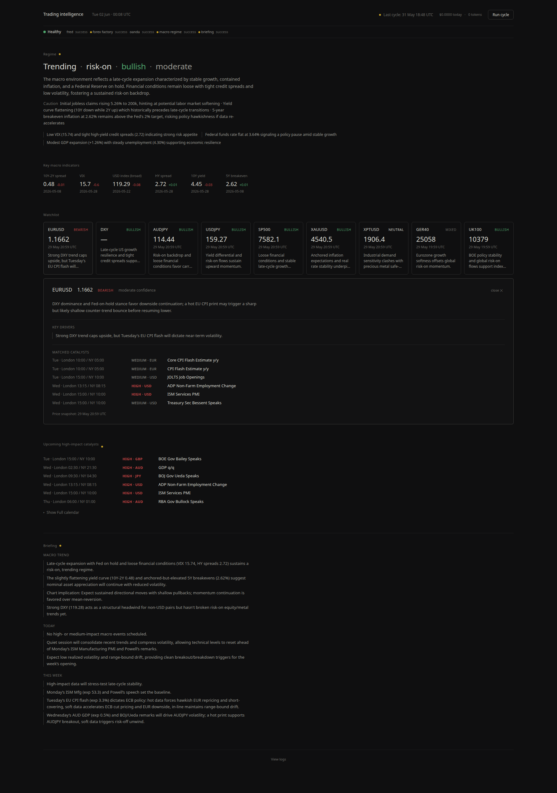
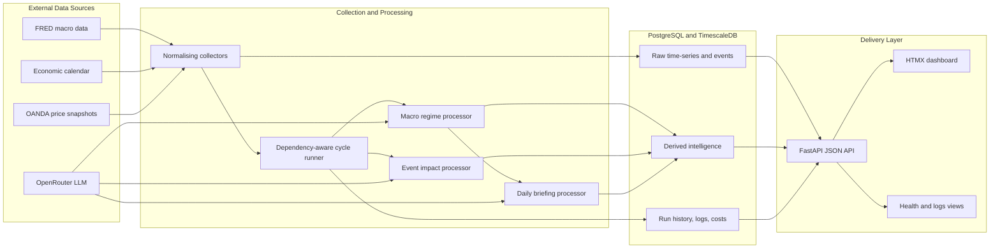
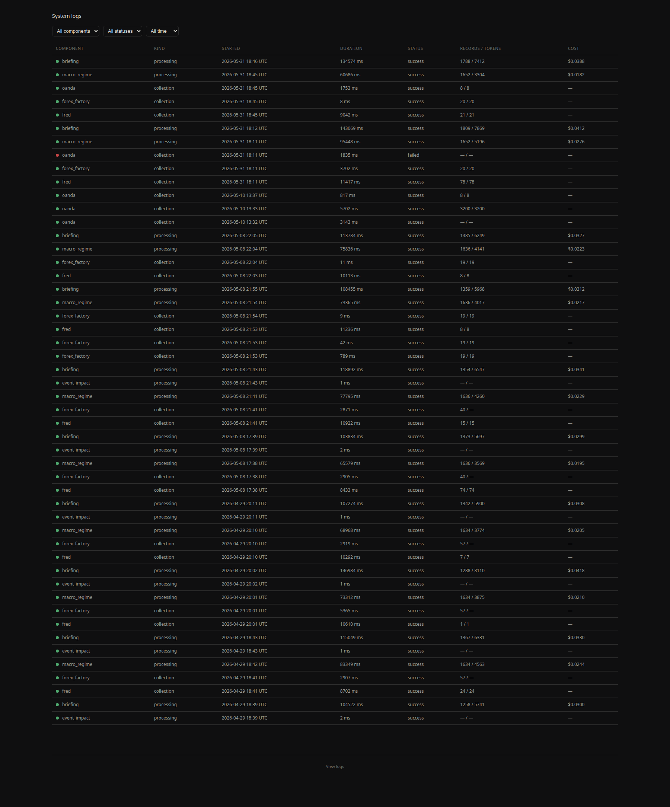

# Trading Data Platform

[](https://github.com/cpu23/trading-data-platform/actions/workflows/ci.yml)
[](https://www.python.org/)
[](https://fastapi.tiangolo.com/)
[](https://www.timescale.com/)
[](https://docs.docker.com/compose/)

A local-first market intelligence platform that collects macroeconomic,
economic-calendar, and price data; runs dependency-aware analytical processors;
and presents traceable daily market context through a FastAPI and HTMX
dashboard.

This public-safe repository demonstrates the platform architecture, collectors,
processors, API, database schema, operational views, and dashboard. It excludes
credentials, generated logs, private databases, proprietary research, and
trading decisions.



## Why This Project Exists

Market context often lives across unrelated websites, spreadsheets, API
responses, and manually written notes. This platform turns those inputs into a
repeatable data workflow:

1. Collect and normalise source data.
2. Store raw observations separately from derived analysis.
3. Run processors only when their dependencies have succeeded.
4. Record lineage, status, duration, model usage, and cost.
5. Present the latest context and operational health in one dashboard.

The platform is decision support, not a signal or execution engine. Analytical
outputs provide context for human review and do not produce trade calls,
entries, or position-sizing instructions.

## Architecture



Every triggered cycle receives a correlation ID that connects collector runs,
processor runs, operational logs, and cycle status. This makes failures and
derived outputs inspectable without mixing raw source data with analysis.

## Engineering Highlights

- **Configuration-driven collectors:** FRED macro series, economic-calendar
  events, OANDA price snapshots, and their intended schedules are defined in
  YAML rather than hard-coded.
- **Dependency-aware processing:** processors run only after their required
  collectors or upstream processors succeed.
- **Traceable LLM usage:** processing logs capture model, prompt version, token
  usage, cost, duration, status, and errors.
- **Resilient collection:** retries, upserts, structured logging, source payload
  caching, and stale-cache fallback reduce avoidable failures.
- **Time-series storage:** PostgreSQL with TimescaleDB stores macro observations
  and market snapshots as hypertables.
- **Operational visibility:** health, freshness, cycle status, logs, and daily
  LLM spend are available through both the API and dashboard.
- **Separated delivery layer:** JSON endpoints and server-rendered HTMX views
  share the same stored data without coupling collection to presentation.
- **News feed** — CLI commands poll Reuters news sitemaps and TwitterAPI.io for
  Kobeissi posts, then publish a normalized, deduplicated feed for the read-only
  FastAPI news endpoints. See
  [docs/news-sources.md](docs/news-sources.md).

## Dashboard

The dashboard is designed as a trader-facing morning context view rather than a
signal engine. It includes:

- Source and processor health with freshness indicators
- Current macro regime and supporting indicators
- Watchlist cards with price snapshots, context, and matched catalysts
- Upcoming high-impact economic events
- Daily briefing and analytical summaries
- Manual cycle controls with live status
- A searchable operational logs view



## API Surface

FastAPI exposes JSON endpoints for:

- Current and historical macro regimes
- Macro dashboard data and individual series
- Upcoming and recent economic events
- Latest and dated daily briefings
- Watchlist context and structured opinions
- System health, logs, and cycle status
- Manually triggered collectors, processors, and full cycles
- Read-only Reuters and Kobeissi feed and source-state views

Reuters and Kobeissi collection is currently operator-triggered through the
orchestrator CLI, not FastAPI. News collection trigger, scheduling, and lineage
endpoints remain deferred roadmap work.

When the API service is running, interactive OpenAPI documentation is available
at `/docs`.

## Data Model

The database keeps responsibilities explicit:

| Layer | Tables | Purpose |
| --- | --- | --- |
| Raw | `macro_series`, `econ_events`, `market_data`, `source_payload_cache` | Normalised source observations and cached upstream payloads |
| Derived | `regime_classifications`, `structured_opinions`, `daily_briefings` | Versioned analytical outputs |
| Operations | `collection_log`, `processing_log`, `cycle_runs` | Status, lineage, errors, duration, token usage, and cost |

## Quick Start

For a populated, credential-free portfolio demo:

```bash
docker compose -f docker-compose.demo.yml up --build
# Open http://127.0.0.1:8001 and sign in with demo / demo
```

The demo seeds deterministic fictional analysis, linked operational runs, and
an in-memory simulated quote stream. It makes no external or paid API calls.

### Prerequisites

- Docker and Docker Compose v2
- A free [FRED API key](https://fred.stlouisfed.org/docs/api/api_key.html)
- An OpenRouter API key for analytical processors
- Optional: an OANDA personal access token for watchlist price snapshots

### Start The Platform

```bash
cp .env.example .env
# Add your API keys and replace the example passwords.
docker compose up -d
```

Docker Compose starts:

- PostgreSQL with TimescaleDB
- The collection and processing orchestrator
- The FastAPI JSON API and dashboard

The dashboard is exposed at `http://127.0.0.1:8001` by default.

### Run And Inspect Collectors

```bash
docker compose exec orchestrator python cli.py collect --all
docker compose exec orchestrator python cli.py status
docker compose exec orchestrator python cli.py health
docker compose logs orchestrator
```

Additional collector commands:

```bash
docker compose exec orchestrator python cli.py collect fred
docker compose exec orchestrator python cli.py collect oanda
docker compose exec orchestrator python cli.py db-check
```

On-demand news collection also runs through the orchestrator CLI:

```bash
docker compose exec orchestrator python cli.py news reuters
docker compose exec orchestrator python cli.py news kobeissi
docker compose exec orchestrator python cli.py news all
```

Kobeissi collection requires `TWITTERAPI_KEY`; Reuters and the read-only news
API do not. Leaving `TWITTERAPI_KEY` empty keeps optional Kobeissi collection
unconfigured until it is invoked with a credential.

## Local Verification

The repository uses locked `uv` environments for the API and orchestrator.

```bash
python3 -m compileall -q -x '/\.venv/' api orchestrator
cd orchestrator
uv sync --frozen
uv run python -m unittest discover -s tests -v
cd ..
docker compose config --quiet
```

The GitHub Actions workflow runs compilation, unit tests, Docker Compose
validation, and a tracked-file secret scan on every push and pull request.

## Project Structure

```text
.
├── api/                    # FastAPI JSON routes, HTMX views, templates, assets
├── config/                 # Collectors, processors, models, schedules, dashboard
├── db/
│   ├── init/               # Initial TimescaleDB and PostgreSQL schema
│   └── migrations/         # Incremental schema changes
├── docs/                   # Architecture notes and dashboard design decisions
├── orchestrator/
│   ├── collectors/         # FRED, economic-calendar, and OANDA collectors
│   ├── processors/         # Regime, event-impact, and briefing processors
│   ├── tests/              # Focused collector and processor unit tests
│   ├── cli.py              # Operator commands
│   └── orchestrator.py     # Dependency-aware cycle execution
├── prompts/                # Versioned public-safe analytical prompt templates
└── docker-compose.yml      # Database, orchestrator, and API services
```

## Design Decisions

**Why separate raw and derived data?**

Source observations remain inspectable even when analytical logic changes.
Derived outputs can be regenerated and reviewed without losing provenance.

**Why a small custom orchestrator?**

The workload is local-first and operated by one user. A compact dependency
runner keeps execution understandable without introducing a distributed
workflow platform before it is needed.

**Why server-rendered HTMX views?**

The dashboard prioritises operational clarity and low maintenance over a large
frontend application. JSON routes remain available for other clients.

**Why keep humans responsible for decisions?**

LLM outputs are useful for synthesis and context, but they can be incomplete or
wrong. The system records evidence and operational metadata while leaving
interpretation and decisions with the user.

## Roadmap

- Synthetic demo mode requiring no external API credentials
- Persistent schedule runner for the configured collection and processing times
- Historical regime timeline and macro comparison views
- Per-claim evidence and data-lineage inspection
- Expanded API, orchestration, and database integration tests
- Data-quality checks for freshness, gaps, duplicates, and anomalies
- Server-side budgets and rate limits for analytical processing
- Explicit migration tooling and TimescaleDB retention policies

## Public Boundary

This repository is intentionally public-safe. It does not include:

- Credentials, `.env` files, or API tokens
- Local databases, generated logs, or private briefings
- Proprietary trading research or strategy logic
- Trade calls, execution instructions, or trading decisions

The screenshots are curated examples of the presentation layer.

## Suggested Repository Topics

`trading`, `market-data`, `data-engineering`, `timescaledb`, `fastapi`,
`htmx`, `docker`, `llm-observability`
