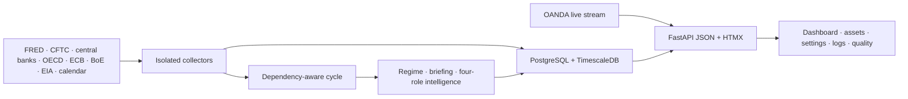

# Trading Data Platform

[](https://github.com/cpu23/trading-data-platform/actions/workflows/ci.yml)
[](https://www.python.org/)
[](https://fastapi.tiangolo.com/)
[](https://www.timescale.com/)
[](https://docs.docker.com/compose/)

A local-first market-intelligence platform for collecting free macroeconomic,
policy, positioning, energy, calendar, and live market data. It publishes
evidence-linked economic assessments through a restrained FastAPI and HTMX
dashboard.

The platform assesses markets. It does not recommend trades, entries, exits,
stops, targets, sizing, or allocation.


## What It Does

- Collects FRED, CFTC COT, central-bank communications, OECD, ECB, BoE, EIA,
  and weekly Forex Factory calendar data.
- Maintains an OANDA live-price stream independently of collection cycles.
- Produces macro-regime, daily-briefing, and per-asset market-intelligence
  snapshots.
- Runs analyst, skeptic, auditor, and editor roles with strict schemas,
  evidence lineage, policy scanning, retry accounting, and atomic publishing.
- Keeps the previous published snapshot visible while a cycle is running.
- Shows current intelligence, cycle changes, watchlist history, source
  freshness, logs, costs, and failures without a permanent sidebar.
- Supports secure first-run setup, session login, resumable configuration, and
  progressively disclosed settings.

## Safety Boundary

AI output is limited to economics, fundamentals, monetary and fiscal policy,
institutional positioning, energy, stress, and identifiable catalysts.

Every generated output is:

1. Parsed against a strict structured schema.
2. Checked for prohibited advisory and technical-analysis language.
3. Checked against supplied evidence and asset-specific economic channels.
4. Repaired at most once when validation fails.
5. Published only as part of a complete validated snapshot.

Invalid output never replaces the last published dashboard state.

## Current Architecture



Collectors fail independently. A complete cycle stages its processor outputs
and publishes regime, briefing, asset assessments, narrative memory, and delta
atomically. Correlation IDs connect cycle records, collector logs, processor
logs, generation attempts, evidence, costs, and published opinions.

See [Current Architecture and Operations](docs/current-architecture-and-operations.md)
for the detailed contracts.

Architecture governance:

- [C4 architecture model](docs/architecture/c4-model.md)
- [Architecture decision records](docs/adr/README.md)

## Quick Start

### Requirements

- Docker with Compose v2
- A FRED API key
- An API key for an OpenAI-compatible endpoint
- An EIA API key for the energy pack
- Optional OANDA practice/live token for streaming prices

### Start a private installation

```bash
cp .env.example .env
# Set database bootstrap values and any credentials you want supplied by env.
docker compose up -d --build
```

Open `http://127.0.0.1:8001`.

On first launch, choose **Explore Demo** or **Set Up My Data**. Setup guides
administrator creation, endpoint testing, watchlist selection, source
coverage, credentials, reasoning effort, budget, and the first analysis.

Credentials entered during setup are stored in the private Docker state volume
with `0600` file permissions. Saved secrets are never returned to the browser.

### Demo

```bash
docker compose -f docker-compose.demo.yml up --build
```

Open `http://127.0.0.1:8001`. The demo uses deterministic fictional data,
requires no external credentials, and makes no paid API calls.

## AI Configuration

The operator default model is:

```text
deepseek/deepseek-v4-flash
```

The default reasoning effort is `high` for general intelligence features.

Market intelligence uses an optimized role profile:

```text
openai/gpt-oss-120b
reasoning: low
provider order: WandB → Novita
```

Role profiles are configuration-driven and can be replaced independently.
The selected profile typically completes in roughly 70–110 seconds and costs
about $0.002 per paid market-intelligence run on the observed workload. See
[Market Intelligence Model Benchmark](docs/intelligence_model_benchmark.md).

## Data Acquisition

| Source | Mode | Notes |
| --- | --- | --- |
| FRED | scheduled/on demand | US growth, inflation, rates, labor, dollar, stress |
| Forex Factory | weekly immutable cache | Live fetch on the first run for a week; cached thereafter |
| CFTC COT | weekly | Participant positioning mapped only to configured assets |
| Central banks | scheduled | Selected Fed and ECB decisions, communications, and speeches |
| OECD | daily collection | Regional composite leading indicators |
| ECB | daily collection | Rates, €STR, systemic stress, credit, and yields |
| BoE | daily collection | Bank Rate, curves, money, credit, and lending |
| EIA | daily collection | Oil prices, petroleum inventories, and gas storage |
| OANDA | continuous stream | Not fetched during collection cycles |

The dashboard identifies the calendar payload as live, cached, or stale-cache.
Freshness checks are frequency and schedule aware.

## Running a Cycle

From the dashboard, use **Run cycle**, or run:

```bash
docker compose exec orchestrator python cli.py collect --all
```

Useful operator commands:

```bash
docker compose exec orchestrator python cli.py status
docker compose exec orchestrator python cli.py health
docker compose exec orchestrator python cli.py collect central_banks
docker compose exec orchestrator python cli.py process market_intelligence
docker compose logs -f orchestrator
```

A normal full cycle includes enabled collectors followed by macro regime,
briefing, and market intelligence. OANDA continues streaming separately.
Unchanged intelligence inputs bypass paid inference.

## Dashboard Surfaces

- `/` — current regime, since-last-cycle delta, source state, watchlist, and
  compact intelligence
- `/assets/{symbol}` — sparse asset history and evidence
- `/settings` — endpoint, model, reasoning, budget, credentials, coverage, and
  security information
- `/logs` — run inspector and detailed collection/processing history
- `/quality` — freshness, gaps, duplicates, and anomaly checks
- `/docs` — interactive JSON API documentation
- `/api/meta/build` — deployed commit, build time, and state readiness metadata

Benchmark runs remain queryable for audit but are hidden from normal operator
history unless explicitly requested through the API.

## Security and Deployment

- Session-based administrator authentication after activation
- Same-origin and CSRF protection for state-changing requests
- Trusted-host enforcement
- Private `0600` credentials, operator profile, and session secret
- Secret redaction: credentials are not returned or written to application logs
- Setup routes lock after activation
- Persistent-state and activation readiness checks

Compose binds the dashboard and database to loopback by default. For LAN or
Tailscale access, explicitly configure trusted hosts and your reverse
proxy/network boundary; the project does not automatically expose or configure
Tailscale.

## Verification

The CI-equivalent local checks are:

```bash
python3 -m compileall -q -x '/\.venv/' api orchestrator

cd orchestrator
uv sync --frozen
uv run python -m unittest discover -s tests -v

cd ../api
uv sync --frozen
STATE_DIR=/tmp/trading-api-ci-state \
CONFIG_DIR=../config \
DB_USER=ci DB_PASSWORD=ci \
FRED_API_KEY=ci OPENROUTER_API_KEY=ci \
OPENROUTER_MODEL=deepseek/deepseek-v4-flash OANDA_API_KEY=ci \
DASHBOARD_USER=ci DASHBOARD_PASSWORD=ci \
uv run python -c "import main; assert main.app.title == 'Trading Data API'"

cd ..
cp .env.example .env
docker compose config --quiet
docker compose -f docker-compose.demo.yml config --quiet
```

GitHub Actions runs Python compilation, locked-environment tests, API import
verification, both Compose validations, and a tracked-file secret scan.

## Repository Layout

```text
.
├── api/                 FastAPI routes, authentication, templates, static UI
├── config/              Sources, schedules, features, models, watchlist
├── db/                  Initial schema, migrations, demo seed
├── docs/                Current operations, benchmark, historical design docs
├── orchestrator/
│   ├── collectors/      Isolated source adapters
│   ├── processors/      Regime, briefing, policy, and intelligence pipeline
│   ├── tests/           Collector, schema, policy, runtime, and failure tests
│   └── cli.py           Operator commands
├── prompts/             Versioned economics-only prompt templates
└── docker-compose.yml
```

## Public Boundary

This repository contains public-safe application code, configuration examples,
schemas, tests, and deterministic demo fixtures. It excludes real credentials,
private databases, generated logs, proprietary research, and trading
decisions.
