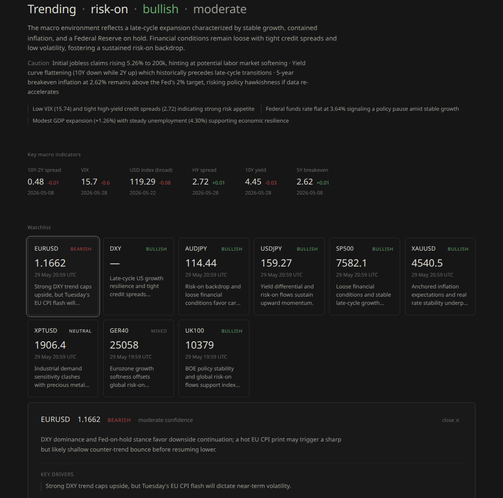

# Trading Data Platform

A modular data platform for collecting, normalising, and analysing market and
macroeconomic data for trading research workflows.

This public snapshot includes the dashboard, API, database schema, collectors,
and orchestration layer. It excludes local credentials, generated logs, private
databases, and proprietary research output.

## Screenshots




## Prerequisites

- Docker and Docker Compose v2
- A FRED API key (free — register at https://fred.stlouisfed.org/docs/api/api_key.html)
- Optional: an OANDA personal access token for cycle-based watchlist prices

## Setup

1. Copy the environment template and fill in your credentials:
   ```bash
   cp .env.example .env
   # Edit .env and add your FRED_API_KEY, optional OANDA_API_KEY, and a strong DB_PASSWORD
   ```

2. Start the platform:
   ```bash
   docker compose up -d
   ```

   This starts PostgreSQL with TimescaleDB and the orchestrator container. The database schema is created automatically on first start.

## Usage

### Open the dashboard

Once the services are running, open the FastAPI dashboard exposed by your
Docker Compose configuration. The dashboard is designed as a trader-facing
morning context view, not a signal engine.

The current layout puts the key decision-support surfaces first:

- Header with last cycle, run-cycle control, and daily LLM cost/token usage
- Health strip with source status and subtle freshness dots
- Regime summary and key macro indicators
- Asset watchlist cards with expandable thesis, drivers, and matched catalysts
- Upcoming high-impact catalysts, with the full calendar behind an expandable control
- Concise briefing bullets

Freshness is shown with small dots instead of warning banners: amber means
stale, red means failed. Hovering a dot shows the source/status details when
available.

Asset-card catalyst matching is a display helper only. It reuses calendar data
to surface relevant HIGH and MEDIUM impact events for each asset exposure, then
sorts them chronologically. It does not mutate stored calendar data, briefing
records, or trading logic.

### Run the FRED collector on demand

```bash
docker compose exec orchestrator python cli.py collect fred
```

### Run all enabled collectors

```bash
docker compose exec orchestrator python cli.py collect --all
```

### Run the OANDA price collector on demand

OANDA is configured for one current price snapshot per mapped watchlist asset into `market_data` with `timeframe = PRICE`, not live streaming or candle history. Add `OANDA_API_KEY` in `.env`, set `collectors.oanda.enabled: true` in `config/config.yaml`, then run:

```bash
docker compose exec orchestrator python cli.py collect oanda
```

### Check collection status

```bash
docker compose exec orchestrator python cli.py status
```

### Health check

```bash
docker compose exec orchestrator python cli.py health
```

### Verify database connection and tables

```bash
docker compose exec orchestrator python cli.py db-check
```

### View logs

```bash
docker compose logs orchestrator
# Or check the rotating log file:
cat logs/app.log
```

## Architecture & Design Decisions

The platform is built around modular data services rather than a single
notebook or dashboard script. Collectors, processors, storage, API routes, and
views are separated so data sources can be added, removed, or repaired without
rewriting the whole system.

PostgreSQL with TimescaleDB is used because the core workload is time-series
data: prices, macro series, economic events, collection timestamps, and
dashboard history. The database schema keeps raw inputs, derived views, and
system logs distinct so research output can be traced back to source data.

LLM briefings are deliberately informational. They are meant to help a trader
understand macro conditions, event context, and what may deserve attention
during the trading day. They do not produce trade calls, entry prices, or
execution instructions; the trader remains responsible for interpretation and
decision-making.

The dashboard follows the same principle. The main catalyst ribbon highlights
upcoming HIGH impact events only, while the full calendar remains available for
medium-impact detail. Expanded asset cards can show both HIGH and MEDIUM
matched catalysts because those are context annotations, not trade triggers.

## Project Structure

```
trading-data-platform/
├── docker-compose.yml          # Services: postgres + orchestrator
├── .env.example                # Template for secrets
├── config/
│   └── config.yaml             # All configuration (sources, schedules, models)
├── prompts/                    # LLM prompt templates (future phase)
├── db/
│   └── init/                   # SQL schema scripts (run on first DB start)
│       ├── 001_extensions.sql  # TimescaleDB + uuid-ossp
│       ├── 002_raw_tables.sql  # macro_series, econ_events, market_data
│       ├── 003_derived_tables.sql  # structured_opinions, regime_classifications, daily_briefings
│       └── 004_system_tables.sql   # collection_log, processing_log
├── orchestrator/
│   ├── Dockerfile              # Multi-stage build with uv
│   ├── pyproject.toml          # Python dependencies
│   ├── main.py                 # Container entry point (scheduler placeholder)
│   ├── orchestrator.py         # run_collector, run_full_cycle
│   ├── db.py                   # Database connection and query helpers
│   ├── logging_config.py       # Structured JSON logging
│   ├── http_client.py          # HTTP client with retries
│   ├── llm_client.py           # OpenRouter wrapper (future phase)
│   ├── config_loader.py        # YAML config with env var substitution
│   ├── cli.py                  # CLI for on-demand runs
│   ├── collectors/
│   │   ├── base.py             # Collector Protocol interface
│   │   └── fred.py             # FRED API collector
│   └── processors/
│       └── base.py             # Processor Protocol interface (stub)
└── README.md
```

## Public Boundary

This repository is intended to show the platform architecture and runnable data
workflow. It does not include private strategy research, local database dumps,
API credentials, generated briefings, run logs, or trading decisions.

## Suggested Repository Topics

`trading`, `market-data`, `timescaledb`, `fastapi`, `dashboard`,
`data-pipeline`
