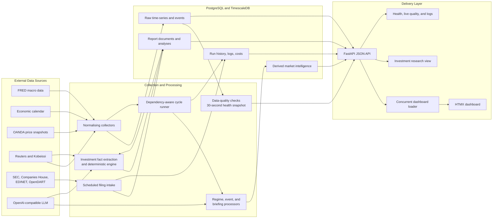

# Trading Data Platform

[](https://github.com/cpu23/trading-data-platform/actions/workflows/ci.yml)
[](https://www.python.org/)
[](https://fastapi.tiangolo.com/)
[](https://www.timescale.com/)
[](https://docs.docker.com/compose/)

A local-first market intelligence platform that collects macroeconomic,
economic-calendar, price, news, and regulatory-filing data; runs
dependency-aware analytical processors; and presents traceable daily market
and company context through a FastAPI and HTMX dashboard.

This public-safe repository demonstrates the platform architecture, collectors,
processors, API, database schema, operational views, and dashboard. It excludes
credentials, generated logs, private databases, proprietary research, and
trading decisions.


## Why This Project Exists

Market context often lives across unrelated websites, spreadsheets, API
responses, and manually written notes. This platform turns those inputs into a
repeatable data workflow:

1. Collect and normalise source data and company reports.
2. Store raw observations and report evidence separately from derived analysis.
3. Run processors only when their dependencies have succeeded.
4. Record lineage, status, duration, model usage, and cost.
5. Present market, investment, and operational context in authenticated views.

The platform is decision support, not a signal or execution engine. Analytical
outputs provide context for human review and do not produce trade calls,
entries, or position-sizing instructions.

## Architecture



Every triggered cycle receives a correlation ID that connects collector runs,
processor runs, operational logs, and cycle status. This makes failures and
derived outputs inspectable without mixing raw source data with analysis.

## Engineering Highlights

- **Configuration-driven collectors:** FRED macro series, economic-calendar
  events, OANDA price snapshots, and their intended schedules are defined in
  YAML rather than hard-coded.
- **Dependency-aware processing:** processors run only after their required
  collectors or upstream processors succeed.
- **Traceable LLM usage:** processing logs capture model, prompt version, token
  usage, cost, duration, status, and errors.
- **Resilient collection:** retries, upserts, structured logging, source payload
  caching, and stale-cache fallback reduce avoidable failures.
- **Time-series storage:** PostgreSQL with TimescaleDB stores macro observations
  and market snapshots as hypertables.
- **Operational visibility:** health, freshness, cycle status, logs, and daily
  LLM spend are available through both the API and dashboard.
- **Durable live delivery:** append-only domain events, transactional outbox,
  leased analysis jobs, immutable section snapshots, replayable SSE
  invalidations, and bounded HTMX partial refreshes decouple ingestion from
  presentation.
- **Separated delivery layer:** JSON endpoints and server-rendered HTMX views
  share the same stored data without coupling collection to presentation.
- **Bounded read latency:** dashboard datasets load concurrently, macro
  indicators use one batched query, and the health path reuses a 30-second
  quality snapshot while `/quality` remains an explicit live diagnostic.
- **Investment research:** deterministic filing deltas, versioned themes and
  theses, evidence history, company dossiers, optional read-only portfolio
  context, and automated SEC/Companies House intake. See
  [docs/investment-research.md](docs/investment-research.md).
- **News feed** — CLI commands poll Reuters news sitemaps and TwitterAPI.io for
  Kobeissi posts, then publish a normalized, deduplicated feed for the read-only
  FastAPI news endpoints. See
  [docs/news-sources.md](docs/news-sources.md).
- **Durable operations** — accepted jobs, heartbeats, advisory locks, restart
  reconciliation, scheduler state, and manual retry remain inspectable across
  process restarts. See [docs/operations.md](docs/operations.md).
- **Measured acceptance** — offline HTTP and browser baselines are recorded in
  [docs/performance-baseline.md](docs/performance-baseline.md).
- **Offline model promotion:** committed core, adversarial, long-context, and
  regression fixtures compare pinned provider slugs with raw usage artifacts,
  blind review, weighted scores, and hard disqualifiers.

## Dashboard

The dashboard is designed as a trader-facing morning context view rather than a
signal engine. It includes:

- Session snapshot, latest price update, material event, regime, next catalyst,
  source state, and budget in a compact top strip
- Since-last-view change summary
- Material change feed and dense sortable watchlist
- Asset evidence drawer, cross-asset context, catalysts, and briefing delta
- Staged macro-release cards and canonical evolving news stories
- Source/processor freshness and historical regime/indicator context
- A separate Research workspace for maintained themes, versioned theses,
  company dossiers, filing deltas, and read-only portfolio context
- Refresh, analyze, and explicit force-full cycle controls with durable status
- Authenticated Dashboard, Research, Investments, Settings, Logs, Quality,
  News, and Operations views

Independent dashboard datasets are loaded concurrently. The dashboard and
settings pages each consume one consolidated system-health response instead of
rerunning the quality suite, and macro indicator summaries are fetched in one
batched database query.

### Current read-path baseline

Warm local measurements from 29 July 2026:

| Route | Median response time |
| --- | ---: |
| Dashboard `/` | 141.53 ms |
| Settings `/settings` | 7.16 ms |
| System health `/api/system/health` | 6.82 ms |
| Macro summary `/api/macro/dashboard` | 124.29 ms |

Chromium first contentful paint was 204 ms for the dashboard and 40 ms for
settings. These are local acceptance measurements, not a production SLA. See
[docs/performance-baseline.md](docs/performance-baseline.md) for the environment,
samples, cache semantics, and reproduction procedure.

The Investments page measured 2.04 ms median server response time and 76 ms
first contentful paint in the same local environment. Its dashboard JSON route
measured 9.14 ms median. See
[docs/investment-research.md](docs/investment-research.md) for filing-status
measurements and operating semantics.


## API Surface

FastAPI exposes JSON endpoints for:

- Current and historical macro regimes
- Macro dashboard data and individual series
- Upcoming and recent economic events
- Latest and dated daily briefings
- Watchlist context and structured opinions
- System health, logs, and cycle status
- Manually triggered collectors, processors, and full cycles
- Read-only Reuters and Kobeissi feed and source-state views
- Investment documents, report URLs, analyses, dashboard aggregates, filing
  source status, and durable filing-collection triggers

Reuters and Kobeissi collection can be invoked through the orchestrator CLI or
the authenticated durable API trigger. Reuters is scheduled every two hours;
Kobeissi remains on-demand by default because it consumes a paid API.

When the API service is running, interactive OpenAPI documentation is available
at `/docs`.

## Data Model

The database keeps responsibilities explicit:

| Layer | Tables | Purpose |
| --- | --- | --- |
| Raw | `macro_series`, `econ_events`, `market_data`, `source_payload_cache`, `investment_documents` | Normalised source observations, report evidence, and cached upstream payloads |
| Derived | `regime_classifications`, `structured_opinions`, `daily_briefings`, `investment_analyses` | Versioned market and company analytical outputs |
| Operations | `collection_log`, `processing_log`, `cycle_runs` | Status, lineage, errors, duration, token usage, and cost |

## Quick Start

For a populated, credential-free live demo:

```bash
docker compose -f docker-compose.demo.yml up --build
# Open http://127.0.0.1:8000 and sign in with demo / demo
```

The demo seeds deterministic fictional analysis and operational history, then
publishes four bounded fictional prices plus real replayable watchlist
invalidations every five seconds. It exercises the production DB→SSE→HTMX
partial path and makes no external or paid API calls.

### Prerequisites

- Docker and Docker Compose v2
- A free [FRED API key](https://fred.stlouisfed.org/docs/api/api_key.html)
- An OpenRouter API key for the enabled analytical processors
- An OANDA personal access token for the enabled watchlist price collector
- A descriptive SEC user agent; Companies House, EDINET, and OpenDART keys are
  optional and enable only their corresponding filing sources

The production configuration treats those three credentials as required because
the corresponding sources/processors are enabled. Empty values fail startup
configuration validation; replace every placeholder before starting. The demo
Compose file remains credential-free by supplying non-secret demo placeholders
and disabling external collection.

### Start The Platform

```bash
cp .env.example .env
# Populate every required FRED, OpenRouter, and OANDA credential and replace
# the example passwords. Required values left blank are rejected at startup.
docker compose up -d
```

Docker Compose starts four independently owned lifecycles:

- PostgreSQL with TimescaleDB
- A checksum-verified one-shot migration gate
- The internal collection, scheduling, and processing orchestrator
- The public FastAPI JSON API and dashboard

Application processes run as UID 10001 with no-new-privileges, bounded memory
and PID limits, immutable upstream image digests, and shared named volumes for
logs and published News. Only the API publishes a host port.

The dashboard is exposed at `http://127.0.0.1:8000` by default.

### Run And Inspect Collectors

```bash
docker compose exec orchestrator python cli.py collect --all
docker compose exec orchestrator python cli.py status
docker compose exec orchestrator python cli.py health
docker compose logs orchestrator
```

Additional collector commands:

```bash
docker compose exec orchestrator python cli.py collect fred
docker compose exec orchestrator python cli.py collect oanda
docker compose exec orchestrator python cli.py db-check
```

On-demand news collection also runs through the orchestrator CLI:

```bash
docker compose exec orchestrator python cli.py news reuters
docker compose exec orchestrator python cli.py news kobeissi
docker compose exec orchestrator python cli.py news all
```

Kobeissi collection requires `TWITTERAPI_KEY`; Reuters and the read-only news
API do not. Leaving `TWITTERAPI_KEY` empty keeps optional Kobeissi collection
unconfigured until it is invoked with a credential.

## Local Verification

The repository uses locked `uv` environments for the API and orchestrator.

```bash
python3 -m compileall -q -x '/\.venv/' api orchestrator
cd api && uv run python -m unittest discover -s tests
cd ../orchestrator && uv run python -m unittest discover -s tests
cd ..
api/.venv/bin/python -m unittest discover -s tests
api/.venv/bin/python scripts/failure_drills.py --unit-only
docker compose config --quiet
docker compose -f docker-compose.demo.yml config --quiet
scripts/test_clean_migrations.sh
scripts/smoke_test.sh
```

The GitHub Actions workflow runs compilation, API/orchestrator/root tests,
deterministic failure drills, migration and fixture checks, Compose validation,
Ruff, dependency audits, clean-migration and live cross-service contracts, the
credential-free demo smoke, and a High/Critical Trivy image gate on every push
and pull request.

## Project Structure

```text
.
├── api/                    # FastAPI JSON routes, HTMX views, templates, assets
├── config/                 # Collectors, processors, models, schedules, dashboard
├── db/
│   ├── init/               # Initial TimescaleDB and PostgreSQL schema
│   └── migrations/         # Incremental schema and investment tables
├── docs/                   # Architecture, operations, performance, investment
├── orchestrator/
│   ├── collectors/         # FRED, economic-calendar, and OANDA collectors
│   ├── processors/         # Regime, event-impact, and briefing processors
│   ├── investment_filings.py  # Regulatory discovery and ingestion
│   ├── investment_service.py  # Document extraction and analysis lifecycle
│   ├── investment_engine.py   # Deterministic scoring and valuation
│   ├── tests/              # Focused service and processor unit tests
│   ├── cli.py              # Operator commands
│   └── orchestrator.py     # Dependency-aware cycle execution
├── prompts/                # Versioned public-safe analytical prompt templates
└── docker-compose.yml      # Database, orchestrator, and API services
```

## Design Decisions

**Why separate raw and derived data?**

Source observations remain inspectable even when analytical logic changes.
Derived outputs can be regenerated and reviewed without losing provenance.

**Why a small custom orchestrator?**

The workload is local-first and operated by one user. A compact dependency
runner keeps execution understandable without introducing a distributed
workflow platform before it is needed.

**Why server-rendered HTMX views?**

The dashboard prioritises operational clarity and low maintenance over a large
frontend application. JSON routes remain available for other clients.

**Why keep humans responsible for decisions?**

LLM outputs are useful for synthesis and context, but they can be incomplete or
wrong. The system records evidence and operational metadata while leaving
interpretation and decisions with the user.

## Roadmap

- Measure production collector and processor latency under an approved upstream
  call budget.
- Add an operator-approved Kobeissi polling budget before enabling its schedule.
- Evaluate independent chart axes or normalization for mixed-scale macro series.
- Define host-level log retention and a tested backup/restore cadence.

## Public Boundary

This repository is intentionally public-safe. It does not include:

- Credentials, `.env` files, or API tokens
- Local databases, generated logs, or private briefings
- Proprietary trading research or strategy logic
- Trade calls, execution instructions, or trading decisions

The screenshots are curated examples of the presentation layer.

## Suggested Repository Topics

`trading`, `market-data`, `data-engineering`, `timescaledb`, `fastapi`,
`htmx`, `docker`, `llm-observability`
