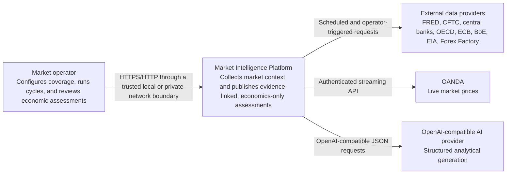
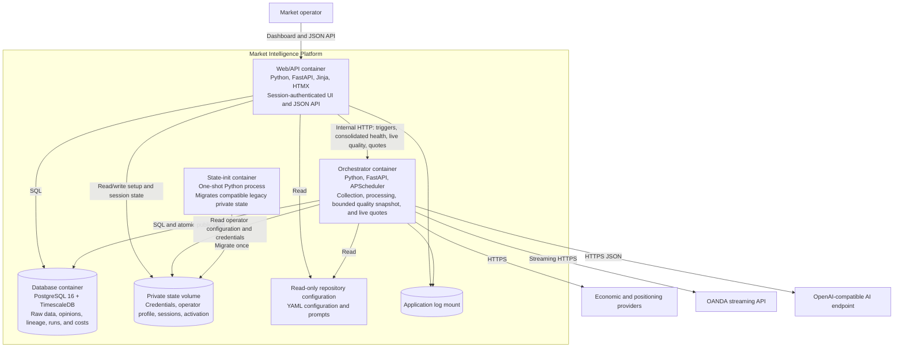
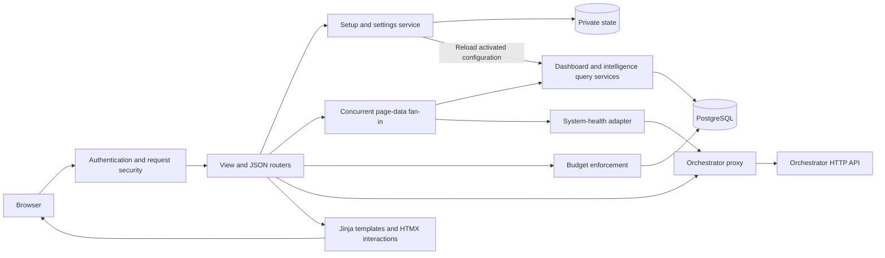
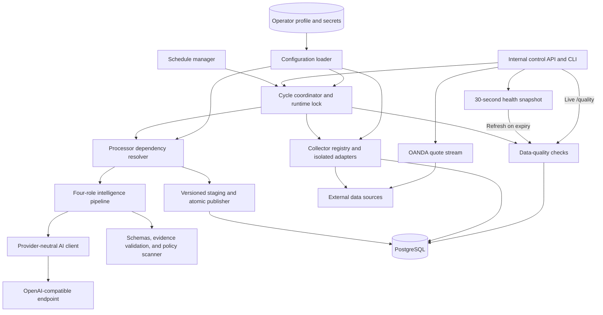
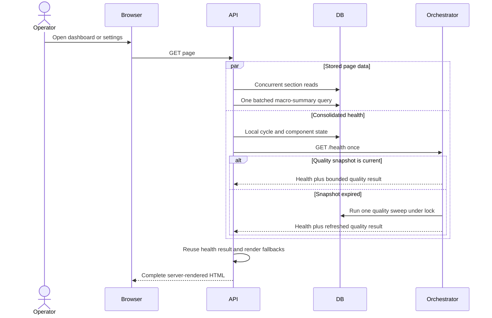
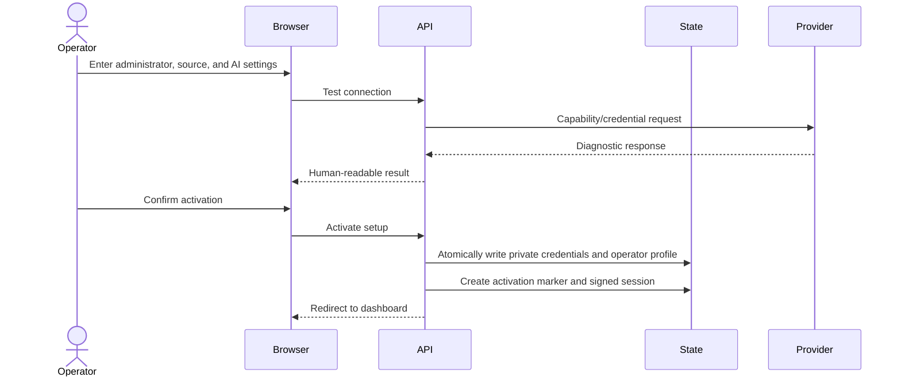

# C4 Architecture Model

**Status:** Current  
**Last reviewed:** 2026-07-29

This model describes the implemented market-intelligence platform. It uses the
C4 hierarchy to show who uses the system, its deployable containers, and the
major components inside the application services.

## Level 1 — System Context



### People

| Person | Responsibility |
| --- | --- |
| Market operator | Activates the installation, supplies credentials, selects coverage and watchlist, runs cycles, and interprets the resulting market assessments. |

### System boundary

The platform is decision support. It assesses economic conditions and their
market relevance but does not recommend trades, entries, exits, stops, targets,
position sizing, or allocation.

## Level 2 — Container Model



### Container responsibilities

| Container | Responsibility | Exposed interface |
| --- | --- | --- |
| Web/API | Authentication, onboarding, settings, concurrent dashboard rendering, evidence/history APIs, budgets, and orchestration proxying. | Loopback-bound port `8000` by default; deterministic demo uses `8001`. |
| Orchestrator | Scheduler, isolated collectors, live and cached data quality, cycle coordination, analytical processors, atomic snapshot publication, and OANDA quote stream. | Internal port `8000`; not host-published by Compose. |
| PostgreSQL/TimescaleDB | Normalized source records, derived intelligence, version history, evidence lineage, operational runs, generation attempts, and retention functions. | Loopback-bound port `5432` by default. |
| State init | Moves compatible legacy state into the private persistent volume before the application starts. | No network interface. |

### Trust boundaries

- The browser reaches the Web/API container only.
- The orchestrator is reachable on the private Compose network.
- Database and API host bindings default to loopback.
- External secrets live in environment variables or private `0600` state files.
- LAN or Tailscale exposure requires an explicitly configured trusted boundary.

## Level 3 — Web/API Components



### Web/API component responsibilities

| Component | Implementation | Responsibility |
| --- | --- | --- |
| Authentication and request security | `api/auth.py`, middleware in `api/main.py` | Signed sessions, login enforcement, CSRF, origin checks, trusted hosts, activation state, and secret-file handling. |
| Setup and settings | `api/routes/json/setup.py`, `api/routes/views/setup.py` | Resumable onboarding, endpoint diagnostics, credential updates, coverage/watchlist configuration, and atomic activation. |
| Dashboard and query routes | `api/routes/json/*`, `api/routes/views/*` | Concurrent page-data fan-in; current and historical intelligence; batched macro summaries; evidence, events, source state, logs, and rendered pages. |
| Budget enforcement | `api/budgets.py`, trigger routes | Daily paid-inference cap and audited explicit overrides. |
| Orchestrator proxy | trigger, watchlist, system, and quality routes | Sends internal triggers, consumes one consolidated health snapshot, and requests live quality or quote state explicitly. |
| Presentation | `api/templates`, `api/static` | Progressive-disclosure server-rendered interface with focused HTMX updates and SSE quote polling. |

## Level 3 — Orchestrator Components



### Orchestrator component responsibilities

| Component | Implementation | Responsibility |
| --- | --- | --- |
| Control surfaces | `orchestrator/main.py`, `orchestrator/cli.py` | Consolidated health snapshots, uncached live quality, quotes, asynchronous triggers, cycle status, and operator commands. |
| Schedule manager | `orchestrator/scheduler.py` | Cron-driven collector and processor dispatch. |
| Cycle coordinator | `orchestrator/orchestrator.py` | Correlation IDs, dependency resolution, advisory runtime lock, progress, failure isolation, staging, and publication. |
| Collectors | `orchestrator/collectors/` | Source-specific acquisition behind normalized contracts and shared persistence. |
| Data quality | `orchestrator/data_quality.py` | Freshness, gap, duplicate, anomaly, and acquisition-state checks; health snapshots bound reuse while `/quality` executes the suite live. |
| Analytical processors | `orchestrator/processors/` | Macro regime, event impact, briefing, and market-intelligence production. |
| AI client | `orchestrator/llm_client.py` | OpenAI-compatible calls, capability fallback, retries, provider metadata, tokens, cost, and latency. |
| Intelligence policy | `orchestrator/processors/_validators.py`, intelligence validators | Structured schemas, prohibited-language checks, evidence eligibility, repair-once behavior, and safe failure. |
| Quote stream | `orchestrator/price_stream.py` | Continuous OANDA or deterministic demo quotes independent of collection cycles. |
| Configuration loader | `orchestrator/config_loader.py` | Merges repository defaults, environment, activated operator profile, and private secrets. |

## Principal Runtime Flows

### Dashboard and settings read path



### Full analytical cycle

```mermaid
sequenceDiagram
    actor Operator
    participant API
    participant Orchestrator
    participant Sources
    participant DB
    participant AI

    Operator->>API: Run cycle
    API->>Orchestrator: POST /run_cycle with correlation ID
    Orchestrator->>DB: Create running cycle record
    loop Enabled collectors
        Orchestrator->>Sources: Fetch source data
        Orchestrator->>DB: Upsert normalized records and acquisition metadata
    end
    Orchestrator->>DB: Load evidence-bounded context
    Orchestrator->>AI: Analyst, skeptic, auditor, editor
    AI-->>Orchestrator: Structured role outputs
    Orchestrator->>Orchestrator: Validate schema, policy, scope, and evidence
    Orchestrator->>DB: Stage validated opinions and briefing
    alt All required stages succeed
        Orchestrator->>DB: Publish complete snapshot atomically
    else Any required stage fails
        Orchestrator->>DB: Mark cycle failed; retain previous snapshot
    end
    API->>DB: Read latest published snapshot
    API-->>Operator: Updated or retained dashboard state
```

### Configuration activation



## Deployment Notes

The checked-in deployment is a single-host Docker Compose topology. This C4
model does not imply independent scaling, a distributed message bus, or a
separate frontend application. Those are deliberately outside the current
architecture.

