# Autonomous research control plane

## Purpose and safety boundary

The autonomous research control plane turns accepted thesis, challenge, forecast,
catalyst and source state into bounded, inspectable research work. It is an
incremental maintenance loop around the existing thesis desk; broad scheduled
thesis discovery remains a separate path.

The control plane is decision support only. It cannot place trades, size
positions, submit orders, connect to an execution API, or mutate read-only
portfolio context. Skills may update research evidence, thesis and forecast
state only through the existing deterministic domain functions and accepted
point-in-time guards.

## Observe-to-outcome lifecycle

```mermaid
flowchart LR
    Observe[Persisted source or thesis state] --> Dirty[Resolve affected dependency nodes]
    Dirty --> Question[Create or refresh atomic question]
    Question --> Planner[Deterministic VOI planner]
    Planner -->|selected| Reservation[Transactional cost/runtime reservation]
    Planner -->|blocked or deferred| Decision[Persist reasoned no-work decision]
    Reservation --> Job[Existing analysis_jobs queue]
    Job --> Skill[Exact immutable skill version]
    Skill --> Validate[Cutoff, source, evidence and numeric validators]
    Validate --> Effect[Append-only effect or justified no-op]
    Effect --> Recompute[Targeted thesis/forecast recomputation]
    Recompute --> Feedback[Productivity and outcome attribution]
    Feedback --> Question
```



1. Market and source events, promoted-candidate gaps, falsification requirements,
   stale evidence dependencies, unconfirmed catalysts, matured forecasts and
   repeated source gaps create or refresh bounded questions.
2. The dependency graph marks only downstream nodes dirty. Broad scheduled
   thesis generation is not rerun for routine maintenance.
3. The pure planner scores every plannable question, persists selected,
   deferred and blocked decisions, and may validly select no work.
4. One PostgreSQL transaction persists the plan, reserves shared budget, creates
   exact-version work orders, and enqueues coalesced `analysis_jobs`.
5. The existing worker lease engine dispatches the registered skill, validates
   its point-in-time and source policy, records the result, and finishes the
   associated job.
6. Every completed order appends a research effect. A result that changes no
   material state is successful only when it records a bounded justified-no-op
   reason.
7. Forecast outcomes and effects feed scorecard views for later operator
   evaluation. They do not rewrite scoring formulas or switch models
   automatically.

## Durable question ledger

`research_questions` has two content-addressed identities. `question_key` hashes
the question type, normalized atomic text, target, required evidence shape and
acceptable source families; it groups the same semantic question across
refresh cutoffs. `fingerprint` adds the immutable accepted cutoff and is unique,
so an exact point-in-time replay always returns the same ledger row. Origin is
deliberately excluded from both: the same semantic question found by a challenge
and a source event shares one exact-cutoff row.

Question upserts are serialized transactionally. A stale or exact replay cannot
overwrite a newer cutoff. A newer cutoff cancels an older still-pending row; if
the older row is already planned, queued or running, the newer cutoff becomes a
distinct pending successor. This preserves accepted-reference order without
allowing stale completion to overwrite newer research.

Origins:

- `promoted_candidate`
- `falsification`
- `stale_dependency`
- `catalyst_confirmation`
- `forecast_resolution`
- `source_event`
- `source_gap`
- `manual`

Supported question types are `earnings_guidance_delta`,
`filing_peer_readthrough`, `positioning_divergence`, `thesis_challenge`,
`forecast_resolution`, `catalyst_confirmation`, `evidence_refresh` and
`source_gap`. Targets are a thesis, group, forecast, catalyst, entity or source.

Question lifecycle:

```text
pending -> planned -> queued -> running -> resolved | unresolvable
           |          |          |
           +----------+----------+-> expired | cancelled
```

A recoverable failed order preserves the running question and prior attempt for
the existing durable job's retry; it does not create another active order.
Terminal question states (`resolved`, `unresolvable`, `expired`, `cancelled`)
cannot return to an active state. PostgreSQL triggers freeze the accepted
identity and point-in-time cutoff.

Unknown and zero are distinct. Priority inputs may be SQL `NULL`; a legitimate
numeric zero remains zero. Unknown required inputs produce named blockers and a
`NULL` score rather than a hidden default. Text, evidence lists, source-family
lists, timestamps, attempts and numeric ranges are bounded in both Python and
PostgreSQL.

## Deterministic planning policy

`orchestrator/research_control_plane/planner.py` is pure: no SQL, network or
model calls. Priority policy `v1` uses finite values in `[0, 1]` for
materiality, uncertainty, discrimination power, urgency, freshness gap and
resolvability:

```text
benefit = materiality
        * uncertainty
        * discrimination_power
        * urgency
        * freshness_gap
        * resolvability

penalty = expected_cost_usd
        + 0.001 * expected_runtime_seconds
        + 0.01 * expected_human_review_minutes (when known)
        + 0.001

priority = benefit / penalty
```

Cost and runtime are required. Human-review cost is optional and contributes no
penalty only when unknown. Sort order is score descending, due time ascending,
creation time ascending, then immutable question UUID. The greedy agenda admits
work only while cost, runtime and work-order-count ceilings all remain
satisfied. Every decision records a stable reason code. Empty input produces
`no_questions`; an agenda with no eligible selection produces
`no_eligible_questions` and performs no model call.

Planning has two concurrency layers:

- a transaction-scoped PostgreSQL advisory lock serializes plan construction;
- row locks and partial unique indexes prevent two planners from reserving the
  same active question or creating two active orders.

The accepted plan snapshot, policy version, estimates, reservation and exact
job/skill links are immutable. Completion order cannot replace a newer accepted
cutoff.

## Skill registry and production skills

`orchestrator/research_control_plane/skill_specs.v1.json` is the checked-in
registry. Startup validates each exact specification and persists its content
fingerprint in `research_skill_versions`. A `(skill_key, version)` cannot drift;
versions referenced by work orders remain inspectable and cannot be deleted or
silently changed. This is a narrow typed registry, not a general plugin system.

Each version declares supported question types, JSON input/output schemas,
allowed tools and source families, point-in-time requirements, model policy,
maximum cost, runtime and attempts, validators and promotion status.

The five active version-1 skills are:

| Skill | Purpose | Production inputs | Model |
| --- | --- | --- | --- |
| `filing.earnings_guidance_delta` | Compare current and prior issuer guidance/margin/cash-flow language | persisted filing documents and deterministic filing deltas | disabled |
| `filing.peer_readthrough` | Find bounded issuer-specific peer read-through evidence | persisted issuer filings/deltas with known thesis relationships | disabled |
| `expectations.positioning_divergence` | Keep options, CFTC, FINRA short-volume and positioning measures semantically separate | point-in-time options and positioning tables | disabled |
| `thesis.targeted_challenge` | Run the existing independent challenge/falsification machinery against one target | accepted thesis/evidence state | disabled |
| `forecast.resolve` | Resolve one matured forecast against boundary-safe prices and append feedback | forecast plus point-in-time market data | disabled |

All SQL reads are bounded and include the work order's `accepted_cutoff` (plus
source-native report/forecast boundaries where applicable). A skill fails closed
when required evidence is absent, a source family is unavailable or undeclared,
output is malformed, a number is non-finite, the target changed beyond its
accepted boundary, or cost/runtime policy is exceeded. It never fabricates a
financial number. Evidence references are content-based and support and
contradiction remain separate.

## Work orders, budgets and recovery

`research_work_orders` links one question, plan, exact skill version, budget
reservation and `analysis_jobs` row. Its lifecycle is:

```text
planned -> queued -> leased -> running -> completed
                    |          |
                    +----------+-> failed_retryable -> queued
                    +----------+-> failed_terminal | stale | cancelled
```

The work-order lease is observational; `analysis_jobs` remains the only lease
owner. Existing `FOR UPDATE SKIP LOCKED`, owner-checked completion, heartbeat,
retry and expired-lease reconciliation semantics apply. Exact input/job
fingerprints coalesce duplicate enqueue attempts. A stale completion cannot
write an effect or overwrite a newer accepted cutoff.

`budget_reservations` is a shared UTC-day ledger for the plan. Reservation uses
an advisory lock and includes existing recorded model spend before admitting a
new plan. It enforces the smaller of:

- `research_control_plane.model_budget_usd_per_plan`; and
- the remaining global `budgets.daily_llm_usd` allowance.

The planner also reserves the configured runtime budget. Per-plan and per-order
limits cannot bypass the global budget. A manual API budget override is audited
before enqueue and does not make unbounded work possible. Reservation is
settled only after every linked order is terminal; actual order costs are
recorded independently.

Recovery rules:

- crash after reservation but before enqueue: the planner transaction rolls
  back;
- crash after enqueue: durable job and order links survive process restart;
- expired analysis-job lease: normal reconciliation returns retryable work to
  the queue;
- crash after effect persistence but before final job completion: append-only
  effect identity makes replay idempotent and completion can be retried;
- retryable skill/database/source failure: preserve the attempt, running
  question and durable job identity for the existing retry path;
- terminal validation failure: mark the order terminal and question
  unresolvable without touching unrelated work;
- duplicate outbox delivery: deterministic event and question fingerprints
  coalesce it;
- stale accepted cutoff: mark the old order stale; never overwrite newer state.

Do not delete queue, question, effect or outbox rows to recover an incident.
Restore the failed dependency and let normal reconciliation and deduplication
run.

## Incremental dependency and event propagation

`research_dependency_nodes` stores typed source, entity, claim, evidence,
assumption, thesis, scenario, forecast, catalyst, risk, playbook, watchlist,
question and effect nodes. `research_dependency_edges` records one of
`supports`, `contradicts`, `depends_on`, `derived_from`, `measures`, `mentions`,
`affects`, `invalidates`, `resolves` or `supersedes`.

Relevant persisted market events are normalized to affected entities, update
source observations, mark bounded downstream nodes dirty, refresh targeted
questions and enqueue one coalesced planner job. The event bucket and input
fingerprint provide a 120-second default debounce. Empty or malformed event
configuration fails closed rather than silently broadening work.

Control-plane UI invalidations use `research_question_changed`,
`research_work_order_changed`, `research_effect_recorded`,
`research_control_plane_changed` and `system_topology_changed`. A topology
invalidation is never routed back into research planning; entering or leaving
the outbox cannot recursively generate another topology event.

## Effects, productivity and outcome feedback

Every completed order appends one `research_effects` row with before/after state
fingerprints, affected target, effect type, material flag, policy version,
evidence attached/removed, scenario/forecast/status changes, actual cost,
runtime, optional review time, evidence reuse/acquisition counts, source
families and bounded summary. Non-material rows require both effect type
`justified_noop` and a reason. Effects and outcome attributions are append-only.

Materiality policy `v1` is explicit rather than inferred from arbitrary JSON
inequality. A completed forecast outcome is material; a falsification effect is
material only when the independent state was newly persisted; guidance or peer
effects require non-empty deterministic deltas; and a core-evidence effect
requires a changed delta or directional positioning disagreement. `noop` and
`unresolved` results are non-material and require a bounded reason. Runtime
rejects a skill result whose claimed `material` flag disagrees with this policy.

`research_outcome_attributions` links resolved forecast outcomes to work order,
exact skill version, question type, source families, accepted cutoff, model and
prompt identity when present, horizon and industry context. The data supports
operator-led promotion or demotion; production formulas and model selection do
not self-modify.

Read-only database views expose:

- control-plane backlog, active/completed work, material effects, justified
  no-ops, stale thesis debt and matured forecast count;
- daily material-change yield, justified-no-op rate, cost per material update,
  median event-to-verified latency, duplicate-work rate and evidence reuse;
- skill-version and source-family scorecards;
- forecast-resolution coverage and Brier/calibration data through the existing
  forecast outcome pipeline.

No metric treats missing forecast coverage, cost or quality as zero.

## Source capability limitations

`research_source_capabilities` distinguishes semantic capability from runtime
availability. A configured source may be capable but unavailable; a running
source may still be semantically unable to answer a question. Planner blockers
and source-gap records preserve that distinction.

Checked-in capabilities cover persisted issuer filings/materials, market price,
options, CFTC positioning, FINRA short volume and thesis evidence. They record
point-in-time status, semantic scope, coverage, optional historical depth,
freshness, latency, cost/rate limits, licensing notes, runtime availability and
recent reliability. Unknown values remain `NULL`.

Public FINRA short volume is a delayed flow proxy, not short interest. The
platform has no public live borrow availability, utilization or borrow-cost
source. Questions requiring those fields remain blocked/source-gap work until a
licensed source is explicitly configured. Filing and provider redistribution
terms remain source-specific; the API exposes references and bounded summaries,
not private raw payloads.

Repeated active gaps are coalesced in `research_source_gaps`. The same gap can
increment observation count and last-seen time without multiplying questions.
At the configured threshold it produces a bounded source-gap question; it does
not invent or purchase an integration.

## Authenticated API

Read endpoints are bounded and fail soft:

```text
GET  /api/research/control-plane/status
GET  /api/research/questions?limit=100&status=...&question_type=...
GET  /api/research/work-orders?limit=100&status=...
GET  /api/system/topology
GET  /partials/operations/system-topology
```

`POST /api/research/control-plane/run` is an authenticated, CSRF-protected
operator override. Normal operation uses the scheduler and event triggers. The
endpoint validates the request before database access, applies the existing API
budget gate, audits an optional override, and returns a coalesced durable job
identity. It does not execute research in the request process.

Responses use shared Pydantic contracts, bounded collections, consistent UTC
timestamps/UUIDs and generic dependency-failure summaries. Work-order responses
exclude private inputs, model payloads and raw results. Raw exception text,
SQL, credentials and provider payloads are never serialized.

## Live operations topology

`/operations` renders one canonical system-topology partial after source and
scheduler health and before detailed operating tables. The same partial is
loaded initially and after live invalidation. There is no second polling loop:
SSE owns live updates while connected; the existing `marketRefresh` heartbeat
is the bounded fallback.

`GET /api/system/topology` assembles bounded persisted state for sources,
collectors, quote stream, scheduler, question planner/queue, durable analysis
and work-order queues, worker, thesis tournament/skills, challenge and
falsification, scoring/forecast resolution, PostgreSQL/TimescaleDB, outbox,
SSE/HTMX delivery, API and operator workspaces. One failed query marks only the
corresponding layer unavailable; it never claims the database is healthy after
a total database failure.

Status is evidence-based: `active` requires recent persisted activity, `idle`
means healthy but no current work, `degraded` means stale or partial,
`unavailable` means the subsystem cannot be queried, `disabled` is configured
off, and `unknown` is used when evidence is insufficient. The inline SVG has a
static accessible summary, screen-reader labels, keyboard-focusable nodes,
detail panel, legend, last-updated timestamp, mobile-contained scroller and
reduced-motion behavior.

## Configuration and demo behavior

Validated keys under `research_control_plane`:

```yaml
research_control_plane:
  enabled: true
  planning_interval_minutes: 15
  event_debounce_seconds: 120
  maximum_questions_per_plan: 20
  maximum_work_orders_per_plan: 8
  maximum_runtime_seconds_per_plan: 900
  model_budget_usd_per_plan: 1.00
  minimum_priority: 0.0
  catalyst_lookahead_days: 30
  stale_question_days: 14
  priority_policy_version: v1
  materiality_policy_version: v1
```

The shared runtime contract rejects out-of-range values and unknown keys under
the repository's normal strict policy. `model_budget_usd_per_plan` cannot exceed
the global daily cap. Reservation lifetime is validated to outlive the longest
allowed call.

Demo mode uses the same migrations, scheduler, queue, topology and HTTP
contracts, fictional persisted data, and disabled external credentials. Empty
planning succeeds without a model call. The demo never calls a paid provider.

## Operator inspection and debugging

Start with authenticated read paths:

```bash
curl --user "$DASHBOARD_USER:$DASHBOARD_PASSWORD" \
  http://127.0.0.1:8000/api/research/control-plane/status
curl --user "$DASHBOARD_USER:$DASHBOARD_PASSWORD" \
  'http://127.0.0.1:8000/api/research/questions?limit=20'
curl --user "$DASHBOARD_USER:$DASHBOARD_PASSWORD" \
  'http://127.0.0.1:8000/api/research/work-orders?limit=20'
curl --user "$DASHBOARD_USER:$DASHBOARD_PASSWORD" \
  http://127.0.0.1:8000/api/system/topology
```

Use `/operations` to correlate planner decisions, active jobs, expired leases,
outbox backlog, the live topology and dependency failures. For one work item,
trace in this order:

1. question UUID and accepted cutoff;
2. latest plan decision and reason codes;
3. budget reservation and exact work-order UUID;
4. linked `analysis_jobs` state, lease owner and attempt;
5. immutable skill key/version/fingerprint;
6. effect or bounded error kind;
7. UI invalidation event and topology last activity.

A planner no-op is expected when there are no questions, all questions are
blocked/not-before/expired/below threshold, or budgets admit no item. Do not
force work merely to make the graph animate. A source-gap question means the
required source is missing or semantically insufficient; fix the collector or
capability declaration rather than attaching fabricated evidence.

After restoring a database, source or worker, run normal health and
reconciliation paths. Retry only retryable jobs. Preserve terminal orders,
effects and outcomes for audit. Compare accepted cutoffs before manually
re-running a stale question.

Architecture rationale and ownership boundaries are recorded in
[ADR 0012](adr/0012-autonomous-research-control-plane.md).
