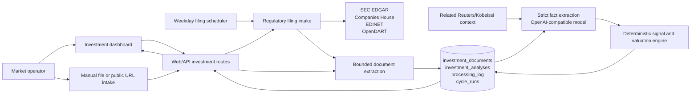

# Investment Research and Filing Intake

**Status:** Current  
**Last reviewed:** 2026-07-29

## Scope

The investment subsystem ingests company reports, extracts auditable facts with
a strict structured model contract, applies deterministic scoring and valuation
rules, and presents regional, industry, company, and report-level research at
`/investment`.

It is decision support. It does not produce trade recommendations, entries,
exits, stops, targets, position sizes, or allocations. Report evidence remains
distinct from related news context and deterministic derived values.

## Architecture



The browser reaches only the Web/API container. Authenticated API routes proxy
to the internal orchestrator with internal Basic authentication. The
orchestrator owns document extraction, filing discovery, model calls,
deterministic analysis, persistence, and durable filing jobs.

## User Interface

`GET /investment` serves the investment research shell. Its JavaScript loads:

- regional coverage for US, EU, and Asia;
- aggregated key-industry state;
- the latest 100 report documents;
- the latest 60 analyses;
- filing-source configuration and the last filing run;
- manual file and public-URL intake;
- optional valuation overrides;
- report analysis and filing-collection controls.

Primary navigation labels this page **Investments**. The page renders explicit
loading, empty, success, and failure states and escapes untrusted values before
adding them to the DOM.

## Filing Sources and Universe

The checked-in `top_us_uk_eu_100` universe contains separate top-100 snapshots
for US, UK, and EU issuers: 300 configured companies in total. The snapshot
source and date are recorded in `orchestrator/investment_universe.py`.

| Source | Coverage and requirements |
| --- | --- |
| SEC EDGAR | US issuers and cross-listed companies with a CIK. No API key; a descriptive `SEC_USER_AGENT` with contact information is required. Complete accession directories, including exhibits, are bundled with bounded downloads. |
| Companies House | UK statutory accounts for companies with permanent company numbers. Requires `COMPANIES_HOUSE_API_KEY`. |
| EU ESEF / national OAMs | Decentralized. Cross-listed issuers can be covered through SEC; remaining issuers are reported as manual coverage. |
| EDINET | Implemented for configured Japanese issuers with EDINET identifiers and `EDINET_API_KEY`. The built-in US/UK/EU universe does not add Japanese issuers. |
| OpenDART | Implemented for configured Korean issuers with corporation identifiers and `OPENDART_API_KEY`. The built-in US/UK/EU universe does not add Korean issuers. |

Discovery is source-rate-limited. Companies are scanned with bounded worker
concurrency. A filing is deduplicated by `(filing_source, filing_id)`, with a
source-URL fallback for records created before source-native identifiers were
stored.

## Schedule and Durable Runs

Current repository defaults in `config/config.yaml`:

| Setting | Default |
| --- | --- |
| Enabled | `true` |
| Schedule | Weekdays at `08:00 UTC` |
| Run on orchestrator startup | `true` |
| Lookback | 730 days |
| Company workers | 4 |
| Automatic analysis after ingestion | `false` |
| Universe | `top_us_uk_eu_100` |

Scheduled and manually triggered collections create durable `cycle_runs` rows
with `run_kind = 'filings'` and `requested_component =
'investment_filings'`. They use accepted/running/completed lifecycle state,
heartbeats, correlation IDs, and the same durable finalization path as other
operator jobs. The scheduler sets `max_instances=1`.

Automatic analysis is disabled by default because it incurs model cost. A
manual filing run may opt into `auto_analyze`; that choice remains subject to
the daily LLM budget and failure contracts.

## Document Intake

The API accepts:

- uploaded PDF, DOCX, text, Markdown, HTML, CSV, JSON, and XML documents;
- bounded public report URLs after scheme, host, address, and redirect checks;
- metadata for company, symbol, region, industry, document type, report date,
  and source URL.

Uploads are limited to 20 MB at both the API stream and orchestrator service
boundaries. Extracted text is capped at 1,000,000 characters. The model excerpt
is capped at 120,000 characters and preserves the beginning, representative
middle sections, and end of oversized reports.

Content SHA-256 is unique, so identical report bytes are not stored twice. A
document moves through `ingested`, `analyzing`, `analyzed`, or `failed` state.
Only one analysis can claim a document at a time.

## Analysis Contract

The `investment_analysis` model stage uses a strict JSON schema to extract:

- classification: document type, sector, canonical industry, region, and
  confidence;
- current and directly comparable prior-period metrics;
- qualitative demand, pricing, supply, competitive, and management signals;
- evidence-bounded summary and thesis;
- drivers, catalysts, risks with mitigations, and watch items.

Every non-null report metric requires its period, unit, and a short report
quote. Related Reuters/Kobeissi items may inform catalyst or crowding context,
but are stored separately and cannot be presented as report evidence. One
bounded correction call is available when configured and the first response is
not valid investment JSON.

After extraction, `investment_engine.py` applies public deterministic signal
weights, period-over-period comparisons, valuation calculations, state
transitions, and optional finite operator overrides. Deterministic output is
stored alongside extracted facts rather than being hidden in model prose.
Actual model, tokens, cost, status, duration, correlation ID, and document ID
are written to `processing_log`.

## Persistence

### `investment_documents`

Stores normalized metadata, source-native filing identity, content hash,
extracted text, lifecycle status, and safe failure state. Important indexes
support company/date and industry/region dashboard queries.

### `investment_analyses`

Stores one current analysis per document, the prior comparable document link,
strict extracted facts, deterministic/enriched analysis, actual model, tokens,
and cost. Updating an analysis preserves the document identity and comparison
chain.

Deleting a document cascades to its analysis; deleting a previous document
clears the comparison link.

## HTTP Surface

Public authenticated API routes:

```text
GET  /investment
GET  /api/investment/dashboard
GET  /api/investment/analyses/{analysis_id}
POST /api/investment/documents
POST /api/investment/urls
POST /api/investment/documents/{document_id}/analyze
GET  /api/investment/filings/status
POST /api/investment/filings/collect
```

The API enforces bounded payloads and maps only approved upstream status codes.
The corresponding orchestrator routes are internal-only and require internal
Basic authentication.

## Credentials and Configuration

Set regulator credentials in private environment or operator state:

```dotenv
SEC_USER_AGENT=TradingDataInvestmentResearch/1.0 contact@example.com
COMPANIES_HOUSE_API_KEY=
EDINET_API_KEY=
OPENDART_API_KEY=
```

`SEC_USER_AGENT` should identify the operator and include a monitored contact.
Never commit live regulator keys. Missing optional keys disable only their
source; SEC coverage continues without an API key.

## Operations

Check the read paths:

```bash
curl http://127.0.0.1:8000/api/investment/dashboard
curl http://127.0.0.1:8000/api/investment/filings/status
```

Use the **Collect filings now** button for an authenticated durable trigger, or
call `POST /api/investment/filings/collect` with CSRF protection from a browser
session. Monitor the returned job ID through durable run status and logs.

A failed source or company is counted in the filing summary without discarding
successful company results. Ingested documents remain available when analysis
is skipped, budget-blocked, or fails.

## Local Read-Path Baseline

Five warm requests on 29 July 2026 measured:

| Route | Response bytes | Median ms | Min ms | Max ms |
| --- | ---: | ---: | ---: | ---: |
| `/investment` | 45,233 | 2.04 | 1.10 | 37.51 |
| `/api/investment/dashboard` | 43,103 | 9.14 | 8.77 | 66.05 |
| `/api/investment/filings/status` | 1,445 | 5.88 | 5.05 | 910.81 |

The filing-status maximum includes its first observed request and is retained
rather than discarded. A Chromium run measured 3.9 ms TTFB, 50.5 ms DOM content
loaded, and 76 ms first contentful paint; dashboard and filing-status API calls
completed in 13.5 ms and 8.9 ms. These are local acceptance measurements, not a
production SLA and not regulator-collection timings.
