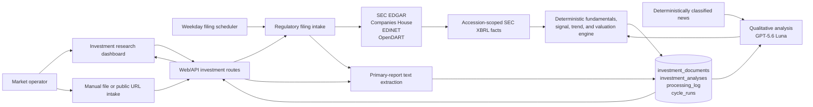

# Investment Research and Filing Intake

**Status:** Current  
**Last reviewed:** 2026-08-01

## Scope

The investment subsystem ingests company reports, selects standardized filing
facts deterministically, uses a strict model contract only for qualitative
analysis, applies deterministic scoring, fundamentals, trend, and valuation
rules, and presents regional, industry, company, and report research at
`/investment`.

It is decision support. It does not produce trade recommendations, entries,
exits, stops, targets, position sizes, or allocations. Report evidence remains
distinct from related news context and deterministic derived values.

## Architecture



The browser reaches only the Web/API container. Authenticated API routes proxy
to the internal orchestrator with internal Basic authentication. The
orchestrator owns document extraction, filing discovery, model calls,
deterministic analysis, persistence, and durable filing jobs.

## User Interface

`GET /investment` serves the investment research shell. Its JavaScript loads:

- regional coverage for US, EU, and Asia;
- a nine-category industry ledger with score, momentum, company breadth,
  revenue growth, free-cash-flow margin, deterministic coverage, and
  company-counted driver and risk claims;
- one-click industry filtering across report trends, news, and company research;
- deterministic company and industry trend series;
- emerging themes from current-versus-prior classified-news windows;
- bounded company and industry news with explicit classification provenance;
- coverage, deterministic extraction, model cost, and duration summaries;
- the latest 100 report documents;
- the latest analysis for each company, bounded to 300 companies, with lazy
  drilldowns for metrics, fundamentals, signals, evidence, and peer comparison;
- manual file and public-URL intake;
- optional valuation overrides;
- report analysis and filing-collection controls.

Primary navigation labels this page **Investments**. The page renders explicit
loading, empty, success, and failure states and escapes untrusted values before
adding them to the DOM.

### Industry taxonomy

Every intake path, news classifier, stored document, stored analysis, aggregate,
and manual form uses the same canonical taxonomy:

1. Semiconductors & Compute
2. Software, Cloud & Communications
3. Energy & Utilities
4. Industrials & Materials
5. Financials & Real Estate
6. Healthcare
7. Consumer
8. Aerospace & Defence
9. Unclassified

Free-text aliases are mapped deterministically. Unknown and unsupported labels
remain `Unclassified`; the classifier does not invent a tenth category.


## Filing Sources and Universe

The checked-in `top_us_uk_eu_100` universe contains separate top-100 snapshots
for US, UK, and EU issuers: 300 configured companies in total. The snapshot
source and date are recorded in `orchestrator/investment_universe.py`.

| Source | Coverage and requirements |
| --- | --- |
| SEC EDGAR | US issuers and cross-listed companies with a CIK. No API key; a descriptive `SEC_USER_AGENT` with contact information is required. Complete accession directories, including exhibits, are bundled with bounded downloads. |
| Companies House | UK statutory accounts for companies with permanent company numbers. Requires `COMPANIES_HOUSE_API_KEY`. |
| EU ESEF / national OAMs | Decentralized. Cross-listed issuers can be covered through SEC; remaining issuers are reported as manual coverage. |
| EDINET | Implemented for configured Japanese issuers with EDINET identifiers and `EDINET_API_KEY`. The built-in US/UK/EU universe does not add Japanese issuers. |
| OpenDART | Implemented for configured Korean issuers with corporation identifiers and `OPENDART_API_KEY`. The built-in US/UK/EU universe does not add Korean issuers. |

Discovery is source-rate-limited. Companies are scanned with bounded worker
concurrency. A filing is deduplicated by `(filing_source, filing_id)`, with a
source-URL fallback for records created before source-native identifiers were
stored.

## Schedule and Durable Runs

Current repository defaults in `config/config.yaml`:

| Setting | Default |
| --- | --- |
| Enabled | `true` |
| Schedule | Weekdays at `08:00 UTC` |
| Run on orchestrator startup | `true` |
| Lookback | 730 days |
| Company workers | 1 |
| Automatic analysis after ingestion | `true` |
| Universe | `top_us_uk_eu_100` |

Scheduled and manually triggered collections create durable `cycle_runs` rows
with `run_kind = 'filings'` and `requested_component =
'investment_filings'`. They use accepted/running/completed lifecycle state,
heartbeats, correlation IDs, and the same durable finalization path as other
operator jobs. The scheduler sets `max_instances=1`.

Automatic analysis is enabled for newly ingested filings. The single company
worker and two bounded OCR page workers limit CPU pressure; model calls remain
subject to the daily LLM budget and failure contracts.

## Document Intake

The API accepts:

- uploaded PDF, DOCX, text, Markdown, HTML, CSV, JSON, and XML documents;
- bounded public report URLs after scheme, host, address, and redirect checks;
- metadata for company, symbol, region, industry, document type, report date,
  and source URL.

Uploads are limited to 20 MB at both the API stream and orchestrator service
boundaries. Extracted text is capped at 1,000,000 characters while retaining
the beginning, end, financial-statement windows, and analysis-signal windows.
The 120,000-character model excerpt independently reserves the beginning and
end before adding evidence-focused windows.

Regulator downloads may be up to 100 MB. Inline-XBRL report packages are read
with bounded member and total-uncompressed limits. PDFs use embedded text when
available, then deterministic page selection and layout-preserving Tesseract OCR
with at most two page workers. OCR and extracted report text remain inputs to
deterministic parsers; they are not treated as model-generated facts.

Content SHA-256 is unique, so identical report bytes are not stored twice. A
document moves through `ingested`, `analyzing`, `analyzed`, or `failed` state.
Only one analysis can claim a document at a time.

## Analysis Contract

The analysis path selects SEC Companyfacts records by exact filing accession
and annual period, parses UK inline-XBRL report packages, and extracts aligned
current/prior statement rows from layout-preserving report text. Revenue, cash
flow, capex, earnings, shares, balance-sheet values, gross margin, and net debt
are normalized by deterministic code. Legacy SEC bundles recover the largest
non-exhibit primary HTML document; new filing bundles prioritize and preserve
the regulator-identified primary document.

The `investment_analysis` stage uses `openai/gpt-5.6-luna` with a strict JSON
schema only for:

- classification: document type, sector, canonical industry, region, and
  confidence;
- qualitative demand, pricing, supply, competitive, and management signals;
- evidence-bounded summary and thesis;
- drivers, catalysts, risks with mitigations, and watch items.

The model schema contains no financial metric fields. Every report metric must
come from accession-scoped XBRL or an aligned statement row with a current/prior
period, unit (including an explicit unknown report-currency unit), and source
quote. Classified news may inform catalyst, industry, theme, and crowding
context, but remains separate from report evidence. One bounded correction call
is available for invalid JSON.

`investment_engine.py` applies public signal weights, period comparisons, free
cash flow, margins, ROA, ROE, leverage, liquidity, cash conversion, DCF,
valuation, and lifecycle rules. The dashboard derives dated industry series,
news momentum, and latest-company industry breadth without model arithmetic.
Observed company metrics are compared with same-industry latest-company
medians, deltas, tie-aware percentiles, and sample counts; these are peer
comparisons, not consensus estimates or live valuation data. Actual model,
tokens, cost, status, end-to-end duration, model-call duration, correlation ID,
and document ID are stored in the analysis and `processing_log`.

## Persistence

### `investment_documents`

Stores normalized metadata, source-native filing identity, content hash,
extracted text, lifecycle status, and safe failure state. Important indexes
support company/date and industry/region dashboard queries.

### `investment_analyses`

Stores one current analysis per document, the prior comparable document link,
strict extracted facts, deterministic/enriched analysis, extraction provenance,
actual model, tokens, cost, and duration. Updating an analysis preserves the
document identity and comparison chain.

Deleting a document cascades to its analysis; deleting a previous document
clears the comparison link.

### `investment_research_observations`

Stores idempotent dated report and classified-news observations with company,
industry, metric, theme, narrative, score, and provenance fields. The dashboard
aggregates this ledger deterministically into report/news counts, company
breadth, filing-fact coverage, average scores, and themes without asking a model
to reconstruct history.

## HTTP Surface

Public authenticated API routes:

```text
GET  /investment
GET  /api/investment/dashboard
GET  /api/investment/analyses/{analysis_id}
POST /api/investment/documents
POST /api/investment/urls
POST /api/investment/documents/{document_id}/analyze
GET  /api/investment/filings/status
POST /api/investment/filings/collect
```

The API enforces bounded payloads and maps only approved upstream status codes.
The corresponding orchestrator routes are internal-only and require internal
Basic authentication.

## Credentials and Configuration

Set regulator credentials in private environment or operator state:

```dotenv
SEC_USER_AGENT=TradingDataInvestmentResearch/1.0 contact@example.com
COMPANIES_HOUSE_API_KEY=
EDINET_API_KEY=
OPENDART_API_KEY=
```

`SEC_USER_AGENT` should identify the operator and include a monitored contact.
Never commit live regulator keys. Missing optional keys disable only their
source; SEC coverage continues without an API key.

## Operations

Check the read paths:

```bash
curl http://127.0.0.1:8000/api/investment/dashboard
curl http://127.0.0.1:8000/api/investment/filings/status
```

Use the **Collect filings now** button for an authenticated durable trigger, or
call `POST /api/investment/filings/collect` with CSRF protection from a browser
session. Monitor the returned job ID through durable run status and logs.

A failed source or company is counted in the filing summary without discarding
successful company results. Ingested documents remain available when analysis
is skipped, budget-blocked, or fails.

## GPT-5.6 Luna Quality Check

Five annual reports—Microsoft, NXP Semiconductors, ArcelorMittal, Deutsche Bank,
and Sanofi—were run concurrently through the strict schema before the extraction
changes:

| Result | Observed |
| --- | ---: |
| Valid first-pass JSON | 5 / 5 |
| Unsupported numeric claims | 0 |
| Extracted financial metrics | 0 / 5 reports |
| Total prompt / completion tokens | 189,662 / 4,985 |
| Total cost | $0.026698 |
| Median individual latency | 8.752 s |
| Five-call wall time | 12.310 s |

Quality assessment: Luna was disciplined and correctly abstained, but the old
excerpt builder exposed accession metadata and XBRL taxonomy files instead of
the primary reports. The model alone was therefore safe but unusable for
financial research. After deterministic primary-document recovery and
accession-scoped XBRL were added, the Microsoft end-to-end run produced 17
deterministic report metrics plus verbatim qualitative evidence. It completed
in 19.3 seconds at $0.0066 on the final verification run.

A subsequent bounded production rerun analyzed 71 latest Companies House annual
reports. All 71 responses validated and were stored; 47 had deterministic filing
facts available at analysis time. The batch used 1,721,334 prompt tokens and
135,606 completion tokens, cost $0.296525, and averaged 16.4 seconds end to end
(9.0 seconds minimum, 61.8 seconds maximum). Spot checks of Microsoft, ICG, and
Spirax-Sarco showed evidence-bounded narratives, explicit thesis invalidators,
separate news context, and deterministic metric provenance. The 24 narrative-
only rows remain visibly marked as missing filing facts rather than presenting
model-inferred financials.

A parser-hardening rerun then replaced 36 affected annual-report analyses; all
36 stored successfully for $0.112680 at 15.7 seconds average model latency. A
final legacy-data scrub made 25 successful Luna calls (426,314 input and 38,804
output tokens, $0.076570, 14.6 seconds average end to end) and one timed-out
call ($0.002956, 397.2 seconds) whose report succeeded on a subsequent retry.
The deployed latest-company set has deterministic filing facts for 162 of 218
companies.
No displayed numeric metric lacks deterministic source/evidence, and no stored
report-text revenue, gross-profit, asset, liability, or equity comparison falls
outside the conservative one-third-to-three-times year-over-year guard.

## Local Read-Path Baseline

Five warm requests on 29 July 2026 measured:

| Route | Response bytes | Median ms | Min ms | Max ms |
| --- | ---: | ---: | ---: | ---: |
| `/investment` | 45,233 | 2.04 | 1.10 | 37.51 |
| `/api/investment/dashboard` | 43,103 | 9.14 | 8.77 | 66.05 |
| `/api/investment/filings/status` | 1,445 | 5.88 | 5.05 | 910.81 |

The filing-status maximum includes its first observed request and is retained
rather than discarded. A Chromium run measured 3.9 ms TTFB, 50.5 ms DOM content
loaded, and 76 ms first contentful paint; dashboard and filing-status API calls
completed in 13.5 ms and 8.9 ms. These are local acceptance measurements, not a
production SLA and not regulator-collection timings.
