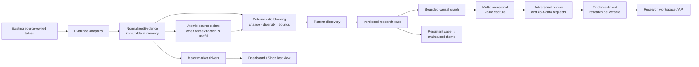

# Research Intelligence

**Status:** implemented as of 2026-08-08  
**Scope:** bounded macro/market context and dynamic investment-research cases  
**Safety boundary:** decision support only; no trade instruction, entry, exit, target, sizing, allocation, or execution output

## Purpose

The research-intelligence subsystem connects two workflows without merging their semantics:

1. **Macro/market context** maintains evidence-linked drivers for the configured major-market universe. It explains what supports or weighs on a market, over which horizon, and what would change the interpretation.
2. **Dynamic investment research** discovers recurring economic developments from bounded evidence, maintains versioned research cases, expands validated causal chains, assesses where economics may accrue, and records the strongest counter-thesis and missing data.

The deterministic spine remains authoritative for prices, release values, reactions, state changes, fingerprints, deduplication, lifecycle transitions, persistence, and query bounds. Models interpret supplied evidence; they do not calculate source facts or control database state.



## Hot, Warm, and Cold Coverage

The tiers describe processing intent, not duplicate storage:

- **Hot:** continuously maintained macro observations, macro release cards, market state, reaction windows, and the configured major-market universe. The bounded regional spine uses official FRED, OECD, ECB, Bank of England, EIA, and CFTC values plus Fed, ECB, Bank of England, and Bank of Japan communications. Hot evidence feeds driver synthesis and can participate in case discovery.
- **Warm:** broad recurring company and industry evidence already held by the platform: Reuters and classified-news stories, canonical story clusters, investment observations, SEC/Companies House filing deltas, investment analyses, and financial facts referenced by those analyses.
- **Cold:** narrow evidence needed to test a weak causal edge or capture claim. The system records a `research_data_requests` row instead of pretending the evidence exists or creating an unbounded collector catalogue.

A cold request records subject, requested evidence type, reason, desired frequency, priority, status, candidate source class, and—when satisfied—the linked evidence identity. Status is one of `unresolved`, `in_progress`, `satisfied`, `unavailable`, or `cancelled`.

Highest-value remaining source gaps are explicit rather than silently inferred:
official fiscal/budget state across all four regions, a licensed or otherwise
reliable earnings-revision feed, and case-triggered industry capacity/lead-time
series. Until a trustworthy source is configured, fiscal state stays unknown
where evidence is absent and micro coverage is represented by
`research_data_requests`, not model-generated facts.

## Normalized Evidence Boundary

`orchestrator/research_intelligence/contracts.py` defines immutable `NormalizedEvidence` and `NormalizedEntity` values. Every normalized item has:

- `evidence_type` and source-owned `evidence_id`;
- canonical `evidence_ref` (`evidence_type:evidence_id`) used by every model contract;
- source name and source timestamp;
- optional acquisition timestamp, title, bounded excerpt, and safe source reference;
- normalized entities;
- bounded structured fields;
- adapter/source provenance and freshness;
- a deterministic content fingerprint.

`orchestrator/research_intelligence/evidence.py` adapts existing records in place. It does not copy all raw content to a generic evidence table. The default registry supports:

| Adapter | Source-owned records | Normalized use |
| --- | --- | --- |
| `macro_observations` | deterministic macro observations | macro state and release history |
| `macro_releases` | immutable current release cards | actual/consensus/previous/revisions/surprise plus release-stage metadata |
| `market_state` | current market-state features | deterministic trend/change context |
| `official_documents` | source-owned Fed/ECB/BoE/BoJ communications | bounded policy communication and guidance context |
| `market_confirmation` | story and macro reaction windows | confirmation, non-confirmation, pending state, and explicit missing-data reasons |
| `story_clusters` | canonical story clusters | bounded recurring narrative evidence |
| `investment_observations` | maintained company/industry observations | warm operating and industry evidence |
| `filing_deltas` | deterministic filing changes | changed disclosures and facts |
| `investment_analyses` | evidence-linked report analyses | bounded company/report context |
| `source_claims` | immutable extracted claims | document-level fact, guidance, estimate, or opinion evidence |

Registry collection is bounded by rolling window, global limit, and per-adapter limit. One adapter failure is returned in `EvidenceCollection.failures`; unrelated adapters still contribute. Duplicate `(evidence_type, evidence_id)` values collapse deterministically.

### Adding a source

1. Keep raw/source-specific persistence in its owning collector or domain table.
2. Implement the `EvidenceAdapter.collect(session, since, limit)` protocol.
3. Return only usable `NormalizedEvidence`; empty output is valid.
4. Use stable source-owned IDs and bounded excerpts. Do not invent a generic ID disconnected from the source record.
5. Put source-specific interpretation in the adapter, not discovery, graph, or value-capture code.
6. Add the adapter to `DEFAULT_ADAPTERS` and add tests for bounds, freshness, provenance, missing values, and failure isolation.

## Atomic Source Claims

`source_claims` sits below `analysis_atoms`. A source claim is immutable extraction from one supplied document-like evidence item; an analysis atom remains a higher-level analytical assertion.

A claim records subject, predicate, optional explicit object/value, unit, period, geography, direction, and `claim_kind` (`reported_fact`, `company_guidance`, `estimate`, or `opinion`). It also stores exactly one source evidence identity, a bounded source span, extraction confidence, normalized entities, model/prompt/attempt provenance, and an input fingerprint.

Validation rules:

- the referenced evidence ID must be in the supplied packet;
- a numeric object/value must appear in the exact source span;
- blank subject, predicate, or span is rejected;
- guidance, estimates, and opinions retain their source kind;
- duplicate claims collapse by deterministic claim fingerprint;
- abstention and an empty claim list are valid;
- database update/delete attempts are rejected by an immutability trigger.

## Dynamic Candidate Discovery

`discovery.py` performs deterministic candidate blocking before a model call:

1. truncate the rolling evidence set to configured bounds;
2. deduplicate by evidence identity;
3. derive normalized terms and adjacent phrases from entities and repeated non-trivial language;
4. exclude document boilerplate, temporal labels, and non-specific entities;
5. collapse extracted claims onto their parent evidence origin so derivative claims cannot manufacture evidence count or source diversity;
6. prefer canonical-story/reaction, entity, and industry blocks before narrower repeated-language blocks, suppressing exact or subset duplicates;
7. require the configured minimum evidence count and source diversity;
8. cap evidence per candidate and candidate count;
9. fingerprint each candidate from evidence identities and blocking key;
10. suppress candidates already processed with the same fingerprint.

The pattern stage decides only whether one bounded candidate is coherent and how to describe it. It may abstain. It cannot cite evidence outside the candidate packet, add unsupported numerical prose, or emit advisory language.

Case matching uses exact semantic fingerprints first, then bounded label/entity/industry similarity. Reprocessing unchanged evidence is idempotent. A changed case creates a new immutable snapshot; it does not overwrite prior analytical history.

## Research Case and Lifecycle

`research_cases` is the central dynamic object. It stores identity, concise definition, origin (`discovered` or `manual`), case type, horizon, lifecycle state, independent importance dimensions, current version, timestamps, input fingerprint, and model/prompt provenance. Related tables retain aliases, entities, evidence links, snapshots, graph edges, capture assessments, counterevidence, and data requests.

Lifecycle is deterministic (`lifecycle.py`):

```text
candidate → forming → corroborated → research_ready → mature
                              ↘ weakening → archived
```

- `forming`: configured minimum evidence count.
- `corroborated`: evidence count, source diversity, and persistence threshold.
- `research_ready`: evidence/source thresholds plus a causal chain, value-capture assessment, adversarial review, and deliverable.
- `mature`: higher evidence and snapshot thresholds plus every completed research stage.
- `weakening` / `archived`: configured days since last evidence.
- `archived` is terminal.

A model assessment is never an input to the lifecycle function.

### Dynamic themes

A case becomes eligible for a maintained `investment_theme` only at `research_ready` or `mature`. Promotion first checks an existing `source_case_id`, then bounded semantic similarity. A matching manual or discovered theme is updated and linked; a duplicate is not created. This keeps manually maintained themes intact while allowing discovered cases to extend them.

## Causal Graph

`relationships.py` owns one allowlisted relationship vocabulary:

`supplies`, `purchases_from`, `consumes`, `depends_on`, `raises_demand_for`, `reduces_demand_for`, `raises_supply_of`, `reduces_supply_of`, `raises_cost_for`, `passes_cost_to`, `constrains`, `substitutes_for`, `complements`, `increases_capex_for`, `derives_revenue_from`, `exposed_to`, `regulates`, `finances`.

Entity types are likewise bounded (`company`, `industry`, `product`, `technology`, `commodity`, `concept`, `macro_region`, `market`, `symbol`, `country`). Every edge includes normalized from/to nodes, relationship, mechanism, epistemic state, supplied evidence IDs, confidence, missing evidence, break conditions, depth, validity interval where supplied, and model/input provenance.

Epistemic state is independent of case lifecycle:

- `observed`: requires direct evidence of an allowlisted deterministic/source-claim family;
- `supported`: interpretation supported by supplied evidence;
- `hypothesis`: mechanism needing further confirmation;
- `rejected`: retained invalidated relationship.

Validation rejects unknown evidence, unsupported observed edges, non-allowlisted relationships, self-loops, and semantic duplicates. Persistence supersedes changed active edges rather than mutating them. Traversal defaults to depth 3, has a hard configurable maximum, prevents cycles per path, and caps graph nodes and edges. PostgreSQL normalized adjacency plus bounded application traversal is the graph implementation; there is no graph database.

## Value-Capture Assessment

Each economically relevant node is assessed independently across nullable dimensions:

- demand impulse, revenue exposure/directness, volume sensitivity;
- supply responsiveness, scarcity, pricing power, cost pass-through, margin sensitivity;
- capital intensity, competitive intensity, barriers to entry, capacity lead time, substitution risk;
- balance-sheet capacity, capital allocation;
- public-market investability, valuation, crowding, evidence strength.

Values are `low`, `moderate`, `high`, or `unknown`/null, each with explicit rationale where available. Evidence IDs and unknowns are stored separately. There is no aggregate opportunity score, ranking, recommendation, or valuation conclusion. Company-level capture remains unknown unless supplied company evidence supports it.

## Adversarial Review and Deliverable

Every developed case receives a distinct adversarial stage. It records alternative explanations, contradicting evidence, weak edges, assumptions, and invalidation claims. Counterevidence with an evidence reference must cite the supplied packet. Unsupported but plausible objections remain `hypothesis`, never manufactured fact.

The same stage emits structured cold-data requests for weak links. Requests are fingerprinted per case so repeated runs are idempotent.

The final deliverable is deliberately scannable:

1. what changed;
2. why it matters;
3. linear transmission;
4. potential economic capture;
5. evidence for;
6. evidence against;
7. weak links / unknowns;
8. what to watch.

Every factual bullet cites supplied evidence. Unsupported numeric prose and trading instructions are rejected. Missing evidence remains visible.

## Macro and Market Drivers

`market_drivers.py` validates one evidence-linked driver per configured target/driver/input identity. A driver records target, label/key, direction (`supportive`, `headwind`, `mixed`, `neutral`, `unknown`), strength, horizon, mechanism, evidence IDs, change state, invalidation/change conditions, confidence, rationale, and full model/input provenance.

The macro stage only receives normalized evidence and the configured hot-market/region universe. Its evidence packet and output cardinality have separate configuration bounds (48 evidence items and eight drivers by default). Unknown targets are rejected. Persistence compares the deterministic fingerprint with the prior current driver, marks `changed_since_prior`, and supersedes prior state. Output is context such as “USD: relative policy expectations supportive,” never a signal.

Release-card and reaction semantics are preserved in adapters. Actual, consensus, previous, revised previous, deterministic surprises, reaction state, and missing-data reasons remain distinct. A reaction is evidence of confirmation or non-confirmation; it is not an alpha score.

The Dashboard loads only current changed drivers and genuinely material cases. The existing **Since your last view** feed remains authoritative for changes; driver changes and research-case changes are additional bounded sections, not a replacement.

## Model Stages and Provenance

Seven versioned strict contracts live in `models.py` and `prompts/`:

| Stage | Prompt/schema version |
| --- | --- |
| atomic claim extraction | `research_claim_extraction_v2` |
| pattern discovery | `research_pattern_discovery_v2` |
| causal expansion | `research_causal_chain_v2` |
| value capture | `research_value_capture_v2` |
| adversarial review | `research_adversarial_v2` |
| concise deliverable | `research_deliverable_v2` |
| macro drivers | `macro_transmission_v3` |

Each stage inherits `llm.models.default` unless a stage override is configured. Reasoning effort and maximum output tokens are per-stage. Inputs are bounded JSON packets. Strict schemas disallow additional properties and permit explicit abstention/unknown values.

Every response is parsed and passed through a deterministic semantic validator. One validation failure gets exactly one repair attempt; a second failure raises `ResearchModelValidationError` and no analytical object from that stage is persisted. `generation_attempts` records prompt, raw response, issues, requested/returned model, provider, prompt identity, tokens, reasoning/cached tokens, latency, cost, retry count, generation ID, stage version, and input fingerprint. Persisted model-derived records point back to the validated attempt.

The subsystem has a per-run model-cost ceiling in addition to the platform
daily LLM budget. Unchanged fingerprints are reused where safe. A public
`force` boolean does not mint budget bypass authority.

## Point-in-Time Replay and Evaluation

Replay uses the production evidence adapters and analytical validators without
mutating live cases, themes, factors, drivers, or requests. Every normalized
evidence item carries `available_at`, an explicit availability basis, and
validity bounds where the source supports revisions. A strict replay context
excludes post-cutoff publications, revisions, reaction windows, and model
outputs before any model call. It records the resulting evidence fingerprint,
exclusion counts, first-visible timestamp, and stage-level model provenance.

Four version-controlled synthetic episodes cover an agricultural supply chain,
AI infrastructure expansion, a monetary-policy regime change, and a plausible
but non-economic noise cluster. Benchmark answers are loaded only by the
deterministic evaluator after research execution. Each episode has authored
replay dates, expected developments, plausible second-order areas, expected
unknowns, forbidden hindsight, and manual milestone timestamps.

Scorecards keep discovery, lead time, specificity, causal quality (including
graph depth), second-order reasoning, value-capture reasoning, evidence
quality, counter-thesis quality, testable-hypothesis discovery, unknown
handling, novelty, and point-in-time integrity as separate dimensions. They
also persist candidate/case counts, abstentions,
failures, evidence breadth, lifecycle timelines, tokens, latency, and cost.
Case output text—not source packets—is the only corpus used for analytical
specificity and forbidden-hindsight checks. Optional human annotations are
versioned and cannot overwrite deterministic scores.

Longitudinal lifecycle history is isolated by a `variant_fingerprint` derived
from every resolved stage model, prompt-content identity, stage version,
reasoning setting, and output-token bound. The full `variant_identity` is
persisted for inspection. This prevents a default-model or prompt-file change
from being mistaken for case persistence. Pairwise regression comparison
requires identical deterministic input fingerprints and reports quality
dimension changes separately from token, latency, and cost deltas.

Operate and inspect with:

```bash
docker compose exec orchestrator .venv/bin/python cli.py research benchmark list
docker compose exec orchestrator .venv/bin/python cli.py research benchmark run <episode-id> --comparison-group baseline
docker compose exec orchestrator .venv/bin/python cli.py research benchmark compare <left-run-uuid> <right-run-uuid>
docker compose exec orchestrator .venv/bin/python cli.py research benchmark annotate <run-uuid> --overall-label partial --dimension causal_quality=pass --annotated-by operator
docker compose exec orchestrator .venv/bin/python cli.py research inspect-replay <run-uuid>
docker compose exec orchestrator .venv/bin/python cli.py research metrics --scope comparison
```

Authenticated JSON routes expose bounded replay runs, details, metrics,
comparison scorecards, human annotations, and run triggers under
`/api/research`. The server-rendered `/research/evaluation` workspace
shows installed episodes, recent variants, quality dimensions, stage failures,
latency, cost, persisted regression comparisons, and live lifecycle cohorts.

Human reviews use `pass`, `partial`, `fail`, or `unclear` labels. They remain
separate from deterministic scorecard dimensions: each write increments
`annotation_version`, appends an immutable history row, and records the operator.
Use `expected_version` through the API or `--expected-version` through the CLI
to reject stale concurrent reviews.

## Orchestration and Failure Semantics

The configured schedule enqueues one deduplicated `research_discovery`
analysis job with `max_instances=1`. Operators can enqueue discovery or one
`research_case_update` through the authenticated API or CLI. Existing
durable-job leasing, heartbeats, retries, deduplication, and terminal states
apply. Normal refreshes coalesce by deterministic input identity; an explicit
forced rebuild or retry receives a new job identity so completed prior work
cannot suppress it.

The durable worker claims the configured bounded batch (25 jobs by default)
before its next poll interval. This preserves per-job provenance while preventing
bursts of section-snapshot publication from starving lower-priority research
work.

The discovery job runs macro drivers and case discovery. Adapter and candidate
failures are isolated and counted. A failed macro stage does not destroy
completed case work; a failed candidate does not roll back unrelated candidate
work. Case snapshots and source claims are immutable. Repository helpers never
commit; the durable worker/session boundary owns transactions.

Inspect with:

```bash
# In the orchestrator container
docker compose exec orchestrator .venv/bin/python cli.py research-run
docker compose exec orchestrator .venv/bin/python cli.py research-status
docker compose exec orchestrator .venv/bin/python cli.py research-inspect <case-uuid>
docker compose exec orchestrator .venv/bin/python cli.py research-update <case-uuid> --force
docker compose exec orchestrator .venv/bin/python cli.py research-rebuild
docker compose exec orchestrator .venv/bin/python cli.py research-retry <job-uuid>

# Authenticated public API; use the host port configured by Compose
curl -u "$DASHBOARD_USER:$DASHBOARD_PASSWORD" http://127.0.0.1:8000/api/research/cases
curl -u "$DASHBOARD_USER:$DASHBOARD_PASSWORD" http://127.0.0.1:8000/api/research/cases/<case-uuid>
curl -u "$DASHBOARD_USER:$DASHBOARD_PASSWORD" http://127.0.0.1:8000/api/research/cases/<case-uuid>/history
curl -u "$DASHBOARD_USER:$DASHBOARD_PASSWORD" 'http://127.0.0.1:8000/api/research/drivers?changed_only=true'
curl -u "$DASHBOARD_USER:$DASHBOARD_PASSWORD" http://127.0.0.1:8000/api/research/status
```

Model-triggering POST controls are model-budget gated. Browser-originated
mutations retain the platform CSRF boundary:

- `POST /api/research/run`
- `POST /api/research/cases/{case_id}/run`
- `POST /api/research/jobs/{job_id}/retry`
- `POST /api/research/replays/{replay_run_id}/annotations` (no model call)

Primary reads are bounded: cases/drivers/history/status and replay-run lists at
100 rows or fewer, case and replay details at 200 items per collection, and
model-attempt status at 250 rows internally. Replay details include bounded,
immutable human annotation history.

## Storage

Migration `039_research_intelligence.sql` adds additive, idempotent tables and
indexes for:

- immutable `research_source_claims` with normalized entities in each claim;
- cases, aliases, entities, evidence, and immutable snapshots, including
  deliverables retained in snapshot payloads;
- causal edges and edge evidence;
- value-capture assessments and assessment evidence;
- counterevidence and counterevidence evidence;
- provenance-linked cold research-data requests;
- current/superseded market drivers and driver evidence;
- links from discovered cases to maintained themes;
- research run kinds and generation-attempt lookup indexes.

Migration `040_research_replay_evaluation.sql` adds immutable replay runs,
replay cases/timelines, versioned benchmark scorecards, quality metrics,
exploratory data-request fields, and shared macro factors/transmissions.
Migration `041_research_economic_factors.sql` normalizes factor identity and
history. Migration `042_research_replay_variant_identity.sql` persists and
indexes resolved replay-variant identities so longitudinal state cannot cross
model/prompt variants.
Migration `043_research_benchmark_annotations.sql` adds immutable human-review
history while the scorecard retains only the current review projection.

Important writes use deterministic unique identities. Active causal edges and
current market drivers have partial unique indexes. Primary read paths are
indexed and explicitly bounded.

## Verification

Focused deterministic coverage lives in:

- `orchestrator/tests/test_research_intelligence.py`;
- `orchestrator/tests/fixtures/research_beef_chain.json`;
- `orchestrator/tests/fixtures/research_data_centre_chain.json`;
- `orchestrator/tests/test_research_replay.py`;
- `orchestrator/tests/test_analysis_jobs.py`;
- `api/tests/test_routes.py`;
- `api/tests/test_frontend_phase10.py`;
- `api/tests/test_research_ui.py`.

The synthetic chains prove candidate discovery, graph state/depth rules,
multidimensional capture with unknowns, adversarial persistence, cold-data
requests, concise deliverables, API bounds, job failure isolation, and rendered
research views without paid or live network calls. Versioned replay episodes
also exercise full research execution at historical cutoffs, leakage guards,
cache identity, lifecycle lead time, scorecards, comparison, and noise
abstention.
